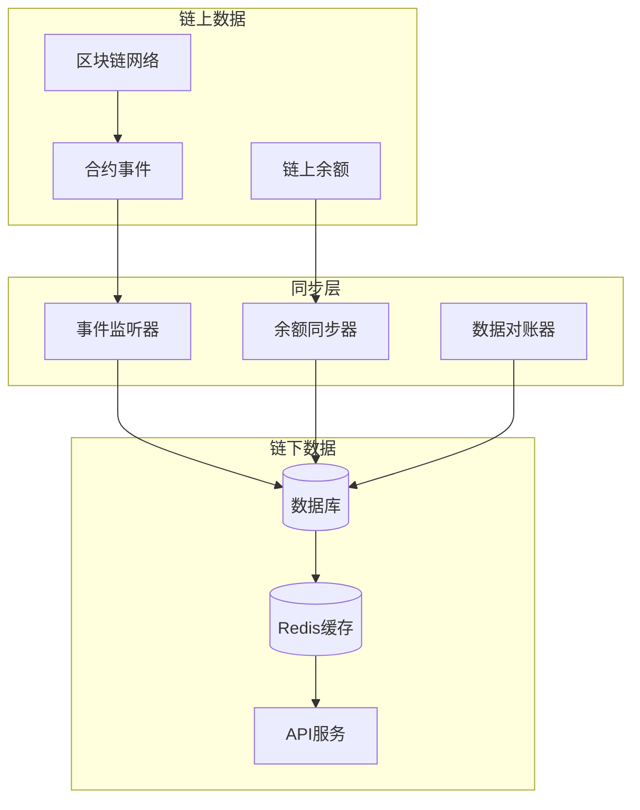
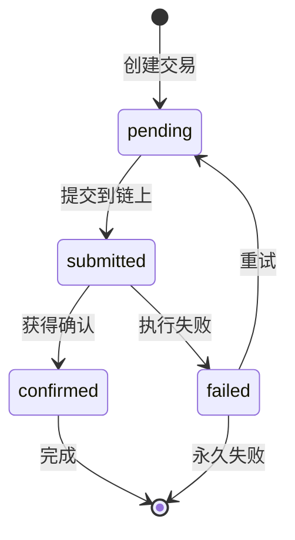

# CustodialBridge 链上链下数据同步策略

## 概述

CustodialBridge需要在提供快速响应的同时，确保链下数据与链上状态的最终一致性。本文档详细说明了数据同步策略。

## 同步架构



## 1. 余额同步策略

### 1.1 多层缓存架构

```go
type BalanceManager struct {
    DB          *Database
    Cache       *RedisCache
    ChainClient map[int64]*ChainClient
    SyncPeriod  time.Duration
}

// 余额查询优先级
func (bm *BalanceManager) GetBalance(userID string, chainID int64, tokenID int) (*Balance, error) {
    // 1. 先查Redis缓存 (TTL: 30秒)
    if balance := bm.Cache.GetBalance(userID, chainID, tokenID); balance != nil {
        return balance, nil
    }
    
    // 2. 再查数据库缓存
    if balance := bm.DB.GetBalance(userID, chainID, tokenID); balance != nil {
        // 更新Redis缓存
        bm.Cache.SetBalance(userID, chainID, tokenID, balance, 30*time.Second)
        return balance, nil
    }
    
    // 3. 最后查链上实时余额（仅在必要时）
    return bm.GetBalanceFromChain(userID, chainID, tokenID)
}
```

### 1.2 同步频率策略

| 资产类型 | 同步频率 | 说明 |
|---------|----------|------|
| CPOP积分 | 实时 | 通过事件监听立即同步 |
| 主流代币(ETH/USDT) | 5分钟 | 定期批量同步 |
| 其他ERC20 | 10分钟 | 较低频率同步 |
| NFT | 15分钟 | 变动较少，低频同步 |

### 1.3 实时事件监听

```go
type EventListener struct {
    ChainClients map[int64]*ChainClient
    EventQueue   chan BlockchainEvent
    Processor    *EventProcessor
}

type BlockchainEvent struct {
    ChainID         int64     `json:"chain_id"`
    BlockNumber     uint64    `json:"block_number"`
    TxHash          string    `json:"tx_hash"`
    EventType       string    `json:"event_type"`
    ContractAddress string    `json:"contract_address"`
    UserAddress     string    `json:"user_address"`
    Amount          string    `json:"amount"`
    TokenID         string    `json:"token_id"`
    Timestamp       time.Time `json:"timestamp"`
}

// 监听关键事件
func (el *EventListener) Start() {
    for chainID, client := range el.ChainClients {
        go el.listenChainEvents(chainID, client)
    }
    
    // 处理事件队列
    go el.processEvents()
}

func (el *EventListener) listenChainEvents(chainID int64, client *ChainClient) {
    // 监听关键合约事件
    events := []string{
        "Transfer",           // ERC20/ETH转账
        "TransferSingle",     // ERC1155转账
        "TransferBatch",      // ERC1155批量转账
        "UserOperationEvent", // EntryPoint事件
        "Mint",              // CPOP铸造
        "Burn",              // CPOP销毁
    }
    
    for _, event := range events {
        go client.SubscribeEvent(event, el.EventQueue)
    }
}
```

## 2. 交易记录同步

### 2.1 交易状态生命周期



### 2.2 交易同步流程

```go
type TransactionSyncer struct {
    DB           *Database
    ChainClients map[int64]*ChainClient
    EventQueue   chan TransactionEvent
}

// 交易状态同步
func (ts *TransactionSyncer) SyncTransactionStatus() {
    // 1. 获取所有pending和submitted状态的交易
    pendingTxs := ts.DB.GetPendingTransactions()
    
    for _, tx := range pendingTxs {
        go ts.syncSingleTransaction(tx)
    }
}

func (ts *TransactionSyncer) syncSingleTransaction(tx *Transaction) {
    client := ts.ChainClients[tx.ChainID]
    
    if tx.TxHash == "" {
        // 还未提交到链上，继续等待
        return
    }
    
    // 查询链上交易状态
    receipt, err := client.GetTransactionReceipt(tx.TxHash)
    if err != nil {
        // 交易可能还未被打包
        return
    }
    
    // 更新交易状态
    updates := map[string]interface{}{
        "block_number": receipt.BlockNumber,
        "gas_used":     receipt.GasUsed,
        "status":       getStatusFromReceipt(receipt),
        "confirmed_at": time.Now(),
    }
    
    ts.DB.UpdateTransaction(tx.ID, updates)
    
    // 如果交易成功，更新用户余额
    if receipt.Status == 1 {
        ts.updateBalanceFromTransaction(tx)
    }
}
```

### 2.3 数据一致性保障

```go
type DataReconciler struct {
    DB           *Database
    ChainClients map[int64]*ChainClient
    Logger       *Logger
}

// 定期数据对账
func (dr *DataReconciler) ReconcileData() {
    // 1. 余额对账
    dr.reconcileBalances()
    
    // 2. 交易记录对账
    dr.reconcileTransactions()
    
    // 3. NFT资产对账
    dr.reconcileNFTs()
}

func (dr *DataReconciler) reconcileBalances() {
    users := dr.DB.GetActiveUsers()
    
    for _, user := range users {
        wallets := dr.DB.GetUserWallets(user.ID)
        
        for _, wallet := range wallets {
            if !wallet.IsDeployed {
                continue
            }
            
            // 对比链上链下余额
            tokens := dr.DB.GetUserTokens(user.ID, wallet.ChainID)
            
            for _, token := range tokens {
                chainBalance := dr.getChainBalance(wallet.AAAddress, token)
                dbBalance := dr.DB.GetBalance(user.ID, wallet.ChainID, token.ID)
                
                // 检查差异
                if !balancesMatch(chainBalance, dbBalance.Balance) {
                    dr.handleBalanceMismatch(user.ID, wallet.ChainID, token.ID, chainBalance, dbBalance)
                }
            }
        }
    }
}

func (dr *DataReconciler) handleBalanceMismatch(userID string, chainID int64, tokenID int, chainBalance, dbBalance *big.Int) {
    difference := new(big.Int).Sub(chainBalance, dbBalance)
    
    dr.Logger.Warn("Balance mismatch detected",
        "user_id", userID,
        "chain_id", chainID,
        "token_id", tokenID,
        "chain_balance", chainBalance.String(),
        "db_balance", dbBalance.String(),
        "difference", difference.String(),
    )
    
    // 如果差异超过阈值，触发告警并自动修正
    threshold := big.NewInt(1000000) // 根据代币精度设置阈值
    if difference.CmpAbs(threshold) > 0 {
        // 发送告警
        dr.sendBalanceMismatchAlert(userID, chainID, tokenID, difference)
        
        // 自动修正（可选，需要管理员确认）
        if dr.shouldAutoCorrect(difference) {
            dr.correctBalance(userID, chainID, tokenID, chainBalance)
        }
    }
}
```

## 3. 同步配置和监控

### 3.1 配置管理

```yaml
# sync_config.yaml
balance_sync:
  redis_ttl: 30s
  db_sync_interval: 5m
  chain_sync_interval:
    cpop: 0s      # 实时
    major_tokens: 5m
    other_tokens: 10m
    nfts: 15m
  
transaction_sync:
  pending_check_interval: 30s
  max_pending_time: 10m
  retry_interval: 1m
  max_retries: 5

reconciliation:
  balance_check_interval: 1h
  transaction_check_interval: 6h
  nft_check_interval: 12h
  mismatch_threshold: "1000000" # wei

monitoring:
  sync_lag_alert_threshold: 2m
  mismatch_alert_threshold: "10000000" # wei
  failure_rate_threshold: 0.05
```

### 3.2 监控指标

```go
type SyncMetrics struct {
    BalanceSyncLag         prometheus.Histogram
    TransactionSyncLag     prometheus.Histogram
    BalanceMismatchCount   prometheus.Counter
    SyncErrorRate          prometheus.Counter
    EventProcessingRate    prometheus.Counter
}

// 监控指标收集
func (sm *SyncMetrics) RecordBalanceSyncLag(duration time.Duration) {
    sm.BalanceSyncLag.Observe(duration.Seconds())
}

func (sm *SyncMetrics) RecordBalanceMismatch(userID string, chainID int64, amount *big.Int) {
    sm.BalanceMismatchCount.With(prometheus.Labels{
        "user_id":  userID,
        "chain_id": fmt.Sprintf("%d", chainID),
    }).Inc()
}
```

## 4. API响应策略

### 4.1 实时性要求分级

```go
type ResponseStrategy struct {
    DB    *Database
    Cache *RedisCache
    Chain map[int64]*ChainClient
}

// 根据业务需求选择数据源
func (rs *ResponseStrategy) GetBalanceForAPI(userID string, chainID int64, tokenID int, realtime bool) (*BalanceResponse, error) {
    if realtime {
        // 实时查询链上余额（用于重要操作）
        return rs.getRealtimeBalance(userID, chainID, tokenID)
    } else {
        // 使用缓存余额（用于展示）
        return rs.getCachedBalance(userID, chainID, tokenID)
    }
}

func (rs *ResponseStrategy) getRealtimeBalance(userID string, chainID int64, tokenID int) (*BalanceResponse, error) {
    // 1. 获取用户钱包地址
    wallet := rs.DB.GetUserWallet(userID, chainID)
    if wallet == nil {
        return nil, errors.New("wallet not found")
    }
    
    // 2. 查询链上余额
    chainClient := rs.Chain[chainID]
    balance, err := chainClient.GetBalance(wallet.AAAddress, tokenID)
    if err != nil {
        return nil, err
    }
    
    // 3. 更新缓存
    rs.Cache.SetBalance(userID, chainID, tokenID, balance, 30*time.Second)
    rs.DB.UpdateBalance(userID, chainID, tokenID, balance)
    
    return &BalanceResponse{
        Balance:     balance.String(),
        Source:      "realtime",
        LastUpdated: time.Now(),
    }, nil
}
```

### 4.2 API响应模式

```json
// 缓存模式响应
{
  "balance": "1000.500000",
  "source": "cache",
  "last_updated": "2024-01-15T10:30:00Z",
  "sync_lag": 30,
  "is_realtime": false
}

// 实时模式响应
{
  "balance": "1000.500000",
  "source": "blockchain",
  "last_updated": "2024-01-15T10:35:00Z",
  "sync_lag": 0,
  "is_realtime": true,
  "chain_confirmation": 12
}
```

## 5. 异常处理

### 5.1 同步失败处理

```go
type SyncFailureHandler struct {
    RetryQueue   chan SyncTask
    DeadLetter   chan SyncTask
    AlertManager *AlertManager
}

func (sfh *SyncFailureHandler) HandleSyncFailure(task SyncTask, err error) {
    task.RetryCount++
    
    if task.RetryCount > MaxRetries {
        // 移入死信队列
        sfh.DeadLetter <- task
        sfh.AlertManager.SendAlert("sync_failure", task, err)
        return
    }
    
    // 指数退避重试
    delay := time.Duration(math.Pow(2, float64(task.RetryCount))) * time.Second
    time.AfterFunc(delay, func() {
        sfh.RetryQueue <- task
    })
}
```

### 5.2 数据修复策略

```go
type DataRepair struct {
    DB          *Database
    ChainClient map[int64]*ChainClient
    Logger      *Logger
}

// 自动数据修复
func (dr *DataRepair) RepairBalance(userID string, chainID int64, tokenID int) error {
    // 1. 获取链上真实余额
    wallet := dr.DB.GetUserWallet(userID, chainID)
    realBalance := dr.ChainClient[chainID].GetBalance(wallet.AAAddress, tokenID)
    
    // 2. 创建修复记录
    repair := &BalanceRepair{
        UserID:      userID,
        ChainID:     chainID,
        TokenID:     tokenID,
        OldBalance:  dr.DB.GetBalance(userID, chainID, tokenID),
        NewBalance:  realBalance,
        Reason:      "auto_repair",
        CreatedAt:   time.Now(),
    }
    
    // 3. 更新余额
    err := dr.DB.UpdateBalance(userID, chainID, tokenID, realBalance)
    if err != nil {
        return err
    }
    
    // 4. 记录修复操作
    dr.DB.CreateBalanceRepair(repair)
    
    dr.Logger.Info("Balance repaired",
        "user_id", userID,
        "chain_id", chainID,
        "token_id", tokenID,
        "old_balance", repair.OldBalance,
        "new_balance", repair.NewBalance,
    )
    
    return nil
}
```

## 6. 性能优化

### 6.1 批量同步优化

```go
// 批量余额查询
func (bm *BalanceManager) BatchSyncBalances(users []string, chainID int64) error {
    // 1. 批量获取用户钱包地址
    wallets := bm.DB.GetWalletsBatch(users, chainID)
    
    // 2. 构造批量查询
    addresses := make([]string, len(wallets))
    for i, wallet := range wallets {
        addresses[i] = wallet.AAAddress
    }
    
    // 3. 批量查询链上余额
    balances, err := bm.ChainClient[chainID].GetBalancesBatch(addresses)
    if err != nil {
        return err
    }
    
    // 4. 批量更新数据库
    updates := make([]BalanceUpdate, len(balances))
    for i, balance := range balances {
        updates[i] = BalanceUpdate{
            UserID:  wallets[i].UserID,
            ChainID: chainID,
            Balance: balance,
        }
    }
    
    return bm.DB.UpdateBalancesBatch(updates)
}
```

### 6.2 智能缓存策略

```go
type SmartCache struct {
    Redis    *RedisCache
    LocalLRU *LRUCache
}

// 多级缓存
func (sc *SmartCache) GetBalance(userID string, chainID int64, tokenID int) (*Balance, bool) {
    key := fmt.Sprintf("balance:%s:%d:%d", userID, chainID, tokenID)
    
    // 1. 本地LRU缓存 (最快)
    if balance, ok := sc.LocalLRU.Get(key); ok {
        return balance.(*Balance), true
    }
    
    // 2. Redis缓存
    if balance := sc.Redis.GetBalance(userID, chainID, tokenID); balance != nil {
        // 回填本地缓存
        sc.LocalLRU.Set(key, balance, 30*time.Second)
        return balance, true
    }
    
    return nil, false
}
```

## 总结

这个同步策略确保了：

1. **快速响应** - 通过多级缓存提供毫秒级API响应
2. **数据一致性** - 通过事件监听和定期对账保证最终一致性
3. **可靠性** - 完善的错误处理和数据修复机制
4. **可监控** - 全面的监控指标和告警机制
5. **可扩展** - 支持多链和大规模用户

核心原则是"缓存优先，实时备选，定期校验"，在性能和一致性之间找到最佳平衡点。