# Chapool TVL 产品化方案设计文档

## 📋 文档信息

- **创建日期**: 2026-03-11
- **状态**: 最终方案
- **优先级**: 高
- **目标**: 为 Chapool 设计可形成真实 TVL、可接入 DefiLlama、且能与现有 NFT / CPOT / CPP 体系联动的产品方案
- **实施路线**: `Chapool Earn (USDT Vault)` → `veCPOT 锁仓 + CPP Utility + NFT Boost` → `Fixed Term Earn` → `NFT Loan`

---

## 🎯 一、项目背景

### 当前问题

目前 Chapool 已经具备以下核心能力：

- `CPNFT` NFT 资产体系
- `Staking` NFT 质押与 CPP 奖励体系
- `Marketplace` NFT 交易与拍卖体系
- `Payment` 离线支付与 ERC20 收款能力
- `CPPToken` 当前链上代币实现

但从 DeFi TVL 的定义来看，当前协议还存在一个明显短板：

- `Staking` 是 NFT 质押，不是稳定币/主流币锁仓
- `CPP` 奖励来自增发，不是来自真实收益池
- `Marketplace` 的 USDT 只在交易过程中短暂停留，无法形成长期沉淀
- `Payment` 虽然托管 ERC20/ETH，但本质是支付收单，不是理财或资金池

这意味着：

- **用户能参与很多功能，但协议里没有足够长期沉淀的资产**
- **DefiLlama 很难把现有功能识别为具有代表性的 TVL**
- **即使可以统计部分余额，也难形成稳定的榜单排名**

### 双代币前提说明

从产品层看，本文档采用双代币视角：

- `CPOT`: 平台对外价值代币，负责市场价值承接、锁仓、会员权益与长期持有逻辑
- `CPP`: 平台内部流通与激励代币，负责奖励发放、生态消费，并通过中心化服务完成 `U卡` 提现与线下消费

说明：

- 当前仓库里的链上实现仍以 `CPPToken` 命名为主
- 本文档按最终产品方案采用 `CPOT + CPP` 的业务视角
- 研发落地时，可以根据最终合约迁移策略决定是否保留现有命名

### 面向管理层的一句话理解

```text
USDT 负责做大 TVL，CPOT 负责承接平台价值，CPP 负责把奖励变成真实消费能力。
```

### 商业结构总览图

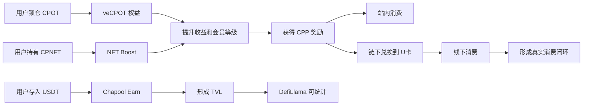

### 目标定义

本方案的目标不是单纯“做一个锁仓按钮”，而是设计一套：

1. **能沉淀真实资产** 的产品
2. **与现有 NFT / CPOT / CPP 体系自然联动** 的产品
3. **用户容易理解、容易参与、容易运营** 的产品
4. **能被 DefiLlama 清晰统计** 的产品
5. **可以分阶段落地** 的产品

---

## 🧭 二、产品结论

### 核心产品组合

Chapool 按下面四层结构推进：

| 模块 | 角色 | 所属阶段 | 对 TVL 的贡献 |
|------|------|----------|---------------|
| `Chapool Earn` | USDT 理财金库 | Phase 1 | 核心 TVL 来源 |
| `veCPOT` | CPOT 锁仓治理与权益 | Phase 2 | 辅助 TVL 与留存 |
| `NFT Boost` | 持 NFT 提升收益 | Phase 2 | 提升 NFT 生态价值 |
| `CPP Utility` | CPP 消费、U卡提现、线下消费服务 | Phase 2 | 提升消费闭环与留存 |
| `Fixed Term Earn` | 定期锁仓理财 | Phase 3 | 提升 TVL 稳定性 |
| `NFT Loan` | NFT 抵押借贷 | Phase 4 | 放大 TVL 与资金效率 |

### Phase 1 从 `Chapool Earn` 开始

Phase 1 直接从 `Chapool Earn` 启动，原因如下：

1. 用户对 `USDT 存入赚收益` 的理解成本最低
2. TVL 可以直接定义为 `Vault 合约内的 USDT 余额`
3. 可以最快接入 DefiLlama
4. 可以自然结合 `CPOT`、`CPP` 与 `CPNFT`
5. 可以最快建立协议对外可展示的核心资产沉淀

### 方案总图

```text
用户资产流

用户 USDT
   ↓
Chapool Earn Vault
   ├─ 形成核心 TVL
   ├─ 产生基础收益
   ├─ 收益受 veCPOT / NFT Boost 影响
   └─ 后续可作为借贷流动性来源

用户 CPOT
   ↓
veCPOT Locker
   ├─ 获得收益加成
   ├─ 获得手续费折扣
   ├─ 获得活动/治理权益
   └─ 获得 CPP 奖励分配权

用户 CPP
   ↓
CPP Utility Service
   ├─ 作为协议内部奖励与消费代币
   ├─ 通过中心化服务兑换或提现到 U卡
   ├─ 支持线下消费场景
   └─ 强化生态内部流通

用户 CPNFT
   ↓
NFT Boost Module
   ├─ 提升 Earn 收益率
   ├─ 提升 Loan 抵押参数
   └─ 强化 NFT 实用性
```

### 老板视角的业务逻辑图

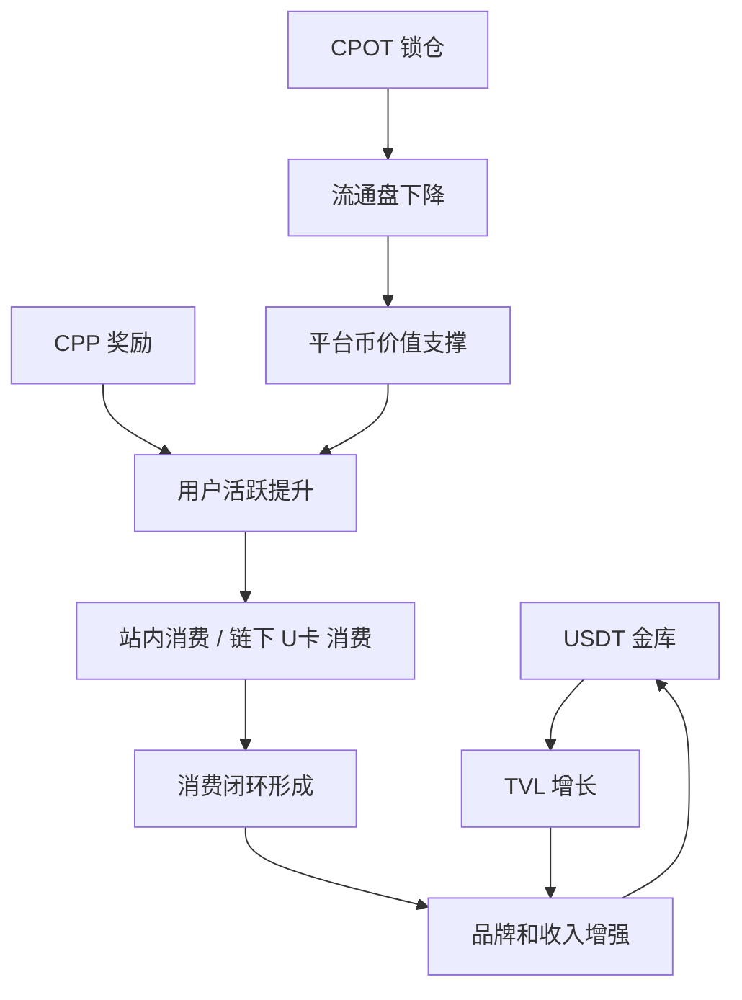

---

## 🏗️ 三、现有系统能力评估

### 1. 已有能力

#### `Staking`

`contracts/CPNFT/Staking.sol` 已具备：

- NFT 质押
- CPP 奖励计算
- 批量 claim / unstake
- 与 AA 账户联动
- 平台级统计信息

但其奖励发放模式是：

- 通过 `CPPTokenContract.mint(...)` 发放奖励
- 不是将 USDT/BNB 等真实资产锁入资金池后再分配

所以它更适合作为：

- 激励模块
- 等级/权益模块
- Boost 条件模块

不适合作为 TVL 主池。

#### `Marketplace`

`contracts/C2C/Marketplace.sol` 已具备：

- NFT 托管
- USDT 支付
- 平台手续费分成
- 拍卖竞价

这说明你们已经有：

- ERC20 收款能力
- 资产托管和结算经验
- 平台费收入来源

这些非常适合接入 `Earn` 作为收益来源之一。

#### `Payment`

`contracts/Payment.sol` 已具备：

- ETH / ERC20 收款
- 代币白名单
- 退款处理

这说明你们有“资金进入协议”的基础路径，但它是支付型资金流，不适合作为长期 TVL 池。

### 2. 现有系统不足

从产品化和 DeFi 化角度看，当前还存在以下问题：

1. 没有“用户主动长期存入资产”的核心产品
2. 没有“份额凭证”或“可计息头寸”模型
3. 没有协议级“净资产”概念
4. 没有可直接输出给 DefiLlama 的 TVL 统计口径
5. 多个核心操作仍偏 `onlyOwner`/后台触发，更像平台托管而非开放协议

---

## 💡 四、产品方案总览

## 4.1 核心产品一：`Chapool Earn`

### 产品定位

`Chapool Earn` 是一个以 `USDT` 为主资产的收益金库产品。

用户可以：

- 存入 USDT
- 获得对应份额凭证
- 按规则获得收益
- 随时查看 TVL、APY、个人收益
- 通过 `veCPOT` 和 `CPNFT` 获得收益加成

### 产品价值

对用户：

- 低理解门槛
- 使用稳定币参与，波动风险低
- 有明确收益预期
- 可与现有 NFT、CPOT、CPP 体系联动

对平台：

- 形成稳定 TVL
- 提升用户留存
- 为 `CPOT` 提供锁仓价值
- 为 `CPP` 提供消费与激励场景
- 为后续借贷提供流动性基础

### Phase 1 产品形态

Phase 1 上线两个模式：

| 产品 | 描述 | 流动性 | 风险 | 上线顺序 |
|------|------|--------|------|------|
| `活期 Earn` | 随存随取，收益浮动 | 高 | 低 | Phase 1 |
| `定期 Earn` | 7/30/90 天锁定，收益更高 | 中 | 中 | Phase 3 |

### Phase 1 不纳入范围

- 高复杂度策略金库
- 杠杆收益产品
- 外部多协议自动调仓

原因是：

- 研发周期长
- 风控难度高
- 不符合当前阶段的核心目标
- 当前阶段的核心任务是做出 **可信、简单、可统计 TVL** 的产品

---

## 👤 五、目标用户与使用场景

### 用户画像 1：稳定收益型用户

特点：

- 手里有 USDT
- 希望低风险放着赚一点收益
- 不熟悉复杂 DeFi 操作

诉求：

- 一键存入
- 收益可视化
- 随时赎回
- 风险可理解

### 用户画像 2：NFT 持有用户

特点：

- 已持有 `CPNFT`
- 已参与过 Staking / Marketplace

诉求：

- 持 NFT 有额外权益
- 不想让 NFT 只是“质押领 CPP”
- 希望 NFT 能提升综合收益

### 用户画像 3：CPOT / CPP 生态用户

特点：

- 持有 CPOT 或 CPP
- 希望代币不只是卖出或领取

诉求：

- CPOT 有锁仓价值
- CPP 有明确消费出口
- 代币能力与平台整体业务挂钩

---

## 🧪 六、产品功能设计

### 三类用户如何进入系统

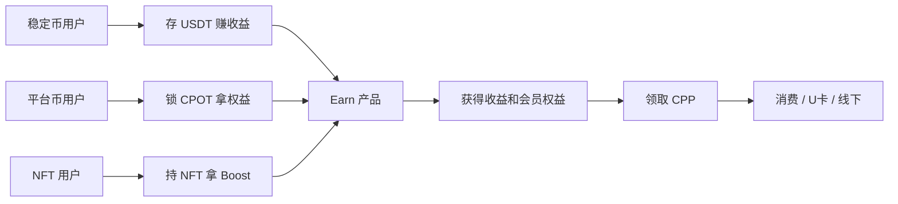

## 6.1 `Chapool Earn` 功能模块

### 1. 存入

用户用 USDT 存入 `Earn Vault`：

- 输入金额
- 授权 USDT
- 点击存入
- 获得 Vault 份额，例如 `ceUSDT`

前端展示：

- 当前 APY
- 可获得基础收益
- 是否有 `veCPOT` Boost
- 是否有 `NFT` Boost
- 实际预计收益率

### 2. 赎回

用户按份额赎回 USDT：

- 活期产品支持随时赎回
- 定期产品到期后免费提现
- 提前赎回可能收取罚金

罚金分配口径：

- 一部分进入协议收入池
- 一部分用于补贴 Vault 收益

### 3. 收益展示

用户应能看到：

- 当前本金
- 当前份额
- 累计收益
- 今日收益
- 历史 APY
- Boost 来源

### 4. Boost 体系

Boost 采用两层：

1. `veCPOT Boost`
2. `NFT Boost`

最终收益率示例：

```text
基础 APY: 8%
veCPOT Boost: +2%
NFT Boost: +1.5%
最终 APY: 11.5%
```

### 5. 产品页结构

前端首页展示：

- TVL
- 总用户数
- 当前基础 APY
- 本周净流入
- Earn 产品卡片
- Boost 权益入口
- 风险说明

---

## 6.2 `veCPOT` 功能模块

### 产品定位

`veCPOT` 是 CPOT 的锁仓权益模块，作为 `Earn` 的权益引擎与平台会员中枢落地。

### 用户操作

用户可以：

- 锁定 CPOT 30 / 90 / 180 / 360 天
- 获得 `veCPOT`
- 锁仓时间越长、数量越多，获得的 `veCPOT` 越高
- 按规则获得 `CPP` 奖励

执行文案统一表述为“锁 CPOT，拿权益，赚 CPP”。

### veCPOT 的核心用途

1. 提高 Earn 收益率
2. 降低 Marketplace 手续费
3. 提升 Launch/活动白名单等级
4. 提升 NFT 抵押借贷额度或利率优惠
5. 获得 `CPP` 奖励分配资格
6. 提升平台会员等级与身份感

### CPP 奖励的去向设计

锁仓奖励发放的 `CPP` 同时承担生态消费功能：

1. 在站内消费、兑换或抵扣部分服务
2. 通过中心化服务提现或兑换到 `U卡`
3. 通过 `U卡` 在线下消费

这意味着 `CPP` 不只是激励积分，而是具有明确消费出口的内部流通资产。

### `CPOT -> CPP -> U卡服务` 价值闭环图

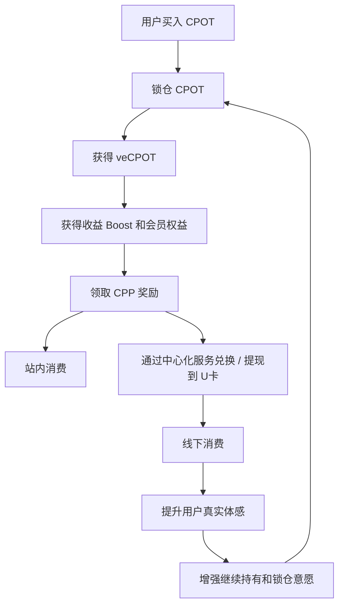

### 设计原则

- veToken 不可转让
- 采用不可转让的治理积分模式
- 到期后用户可解锁原始 CPOT
- 提前退出可以设置罚没机制
- 锁仓奖励以 `CPP` 发放，不直接增发 `CPOT`

### 为什么需要 veCPOT

如果只有 `Earn`，TVL 能起来，但 `CPOT` 的长期持有价值和 `CPP` 的内部消费闭环仍然偏弱。  
引入 `veCPOT` 后，可以把：

- 平台代币 `CPOT`
- 稳定币理财
- 内部消费代币 `CPP`
- NFT 权益
- 后续借贷

串成一个完整体系。

---

## 6.3 `NFT Boost` 功能模块

### 产品定位

`NFT Boost` 用于让 `CPNFT` 从“质押拿 CPP 的资产”升级为“整个协议的权益通行证”。

### 推荐规则

按 NFT 等级给不同收益加成：

| NFT Level | Earn APY Boost | 说明 |
|-----------|----------------|------|
| L1 | +0.5% | 入门权益 |
| L2 | +1.0% | 基础加成 |
| L3 | +2.0% | 高级加成 |
| L4 | +3.5% | 核心会员权益 |

### 权益规则

- 只持有即可生效
- 必须额外质押 NFT 才生效
- 同一地址最多计算 N 个 NFT
- `veCPOT` 与 NFT 同时满足时，触发组合加成

### 实施口径

Phase 2 实施口径：

- **持有即加成**
- 不要求再次锁 NFT

原因：

- 前端理解简单
- 使用门槛低
- 不会与现有 `Staking` 冲突
- 后续仍可升级成“质押型会员”

---

## 6.4 Phase 4 产品：`NFT Loan`

### 产品定位

`NFT Loan` 是使用 `CPNFT` 作为抵押物借出 USDT 的借贷产品。

### Phase 4 上线原因

虽然它很适合强化 NFT 金融属性，但存在以下难点：

1. NFT 估值难
2. 清算逻辑复杂
3. 风控模型复杂
4. 坏账风险高
5. 用户教育成本较高

### 产品形态

- `Pool-based NFT Lending`

模式为：

- 出借人把 USDT 存入 Lending Pool
- 借款人抵押 `CPNFT`
- 协议按 LTV 发放借款
- 逾期则清算 NFT

### 与 Earn 的关系

Phase 4 可以把 `Earn Vault` 的部分资金作为借贷流动性来源，但在 Phase 1-3 保持逻辑隔离：

- `Earn Vault` 独立
- `Lending Pool` 独立

等风控模型成熟后，再考虑资金联通。

---

## 💰 七、收益来源设计

这是最关键的产品问题之一。

### 收益来源组合

| 收益来源 | 执行口径 | 说明 |
|----------|----------|------|
| 平台手续费分成 | 是 | 最真实、可持续 |
| 项目方阶段性补贴 | 是 | 冷启动需要 |
| CPP 额外激励 | 是 | 用于放大吸引力 |
| CPOT 锁仓导流 | 是 | 提升平台币锁仓率与会员粘性 |
| 外部协议收益 | Phase 1-3 不纳入 | 增加复杂度 |

### 推荐收益结构

```text
用户总收益 = 基础收益 + 活动补贴 + CPP 激励

基础收益:
来自 Marketplace 手续费、平台收入返还等

活动补贴:
冷启动阶段平台补贴 USDT

CPP 激励:
按活动规则发放 CPP，提升吸引力，并进入站内消费或链下 U卡 线下消费路径
```

### 为什么不能只发 CPP

如果 `Earn` 存的是 USDT，但收益完全来自增发 CPP，会有几个问题：

1. 用户对“真实收益”的信任较低
2. CPP 抛压会更大
3. 难以形成长期可持续模型
4. DefiLlama 可以统计 TVL，但外部会质疑收益质量

因此执行口径为：

- **基础收益尽量用真实收入或补贴 USDT 支撑**
- **CPP 用作激励增强，而不是唯一收益来源**

### 为什么 `CPP -> U卡服务 -> 线下消费` 很重要

如果 `CPP` 只负责发放，不负责消费，最终容易演变为单向抛压资产。  
而当 `CPP` 可以通过中心化服务提现到 `U卡` 并用于线下消费时，它就有了明确的使用出口：

1. 用户更容易理解 `CPP` 的真实用途
2. 奖励不再只是“卖出”，也可以直接变成消费力
3. 平台可以将 `CPP` 与零售、会员、线下商户体系打通
4. `CPOT` 锁仓获取 `CPP` 的逻辑会更像“获得消费与权益能力”，而不是单纯挖矿

### 双代币闭环

```text
用户买入 CPOT
→ 锁仓获得 veCPOT
→ 获得 Earn Boost / 会员权益 / CPP 奖励
→ CPP 在站内消费，或通过中心化服务提现到 U卡
→ 用户在线下消费
→ 平台形成消费闭环与代币价值支撑
```

### 为什么这个闭环更有说服力

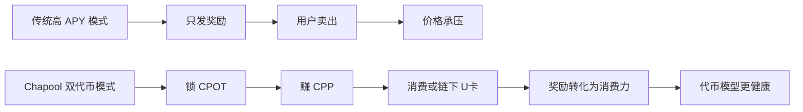

---

## 🪙 八、TVL 口径与 DefiLlama 接入设计

## 8.1 TVL 定义

Phase 1-3 的 TVL 定义保持简单：

```text
TVL = Earn Vault 合约持有的 USDT 余额
```

若后续增加多个池子，可定义为：

```text
TVL = 活期 Vault USDT + 定期 Vault USDT + Lending Pool 中未借出的 USDT + 其他策略金库净值
```

### Phase 1-3 不计入的资产

- `CPP` 锁仓价值
- `CPNFT` NFT 地板价估值
- `Marketplace` 挂单中的 NFT
- 临时经过 `Payment` 的支付余额

### 关于 `CPOT` 锁仓的口径

若 `CPOT` 已公开流通、可定价且锁在可验证合约中，可以单独作为“锁仓价值”或扩展 TVL 口径进行展示。  
Phase 1-3 对外主口径保持简单：

- 主 TVL: `USDT Vault`
- 平台币锁仓价值: `CPOT Locker`
- 内部奖励/消费代币: `CPP`

原因：

- 估值口径复杂
- 外部争议大
- DefiLlama 通常更偏好可验证的链上资产余额

### 对外展示口径图

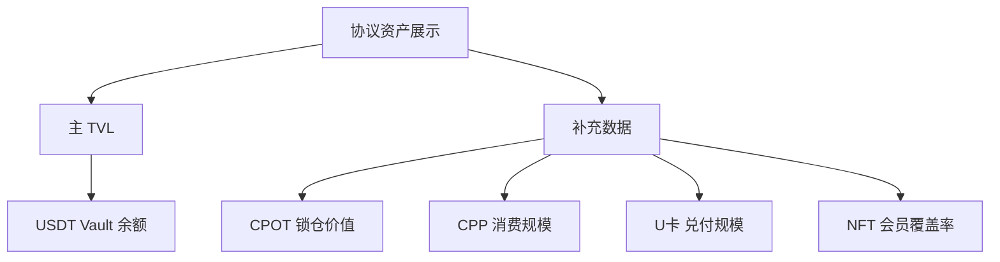

## 8.2 DefiLlama 最友好的结构

为方便接入 DefiLlama，产品设计满足以下条件：

1. 主池资产尽量使用标准 ERC20，例如 USDT
2. TVL 合约地址尽量固定且清晰
3. 不要把 TVL 分散在过多临时中间合约
4. 合约之间的资金流要易于追踪
5. 最好提供只读函数输出池总资产

### 对外暴露的只读函数

```solidity
function totalAssets() external view returns (uint256);
function totalShares() external view returns (uint256);
function getVaultAPR() external view returns (uint256);
function getUserPosition(address user) external view returns (...);
```

### DefiLlama 适配最小口径

如果只有一个 Vault，适配器甚至可以只读：

- `USDT.balanceOf(vaultAddress)`

这会极大降低接入成本。

---

## 🧱 九、合约模块设计

## 9.1 新增合约

新增以下模块：

| 合约 | 作用 |
|------|------|
| `ChapoolEarnVault` | 主金库，负责存取款与份额 |
| `ChapoolRewardDistributor` | 收益注入与分配 |
| `VeCPOTLocker` | CPOT 锁仓、veCPOT 计算与奖励资格管理 |
| `NFTBoostController` | 根据 NFT 持仓计算 Boost |
| `ChapoolVaultReader` | 前端查询与聚合只读接口 |

### 链下服务模块

| 服务 | 作用 |
|------|------|
| `CPP Consumption Service` | 管理 CPP 的站内消费、账户余额与订单映射 |
| `UCard Redemption Service` | 管理 CPP 到 U卡的提现、兑换、审批与到账 |
| `Settlement & Reconciliation Service` | 管理线下消费清算、对账、风控与财务核销 |

### 模块职责说明

#### `ChapoolEarnVault`

负责：

- 接收 USDT 存入
- 发行份额
- 处理赎回
- 记录总资产与总份额

#### `ChapoolRewardDistributor`

负责：

- 接收平台收益注入
- 更新收益指数
- 给 Vault 提供基础收益率参数

#### `VeCPOTLocker`

负责：

- 锁定 CPOT
- 计算 `veCPOT`
- 提供用户 Boost 系数
- 计算用户可领取的 `CPP` 奖励资格

#### `CPP Consumption Service`（链下）

负责：

- 记录 `CPP` 的消费路径
- 管理站内消费订单与余额映射
- 为前端提供 `CPP` 可消费余额、已提现余额等视图

#### `UCard Redemption Service`（链下）

负责：

- 对接 `U卡` 提现或兑换流程
- 管理申请、审批、到账与失败重试
- 输出用户侧的提现记录与状态

#### `NFTBoostController`

负责：

- 读取用户 `CPNFT` 持仓或指定质押状态
- 按等级映射收益 Boost

#### `ChapoolVaultReader`

负责：

- 聚合多个合约只读数据
- 给前端和第三方查询统一入口

### 系统模块关系图

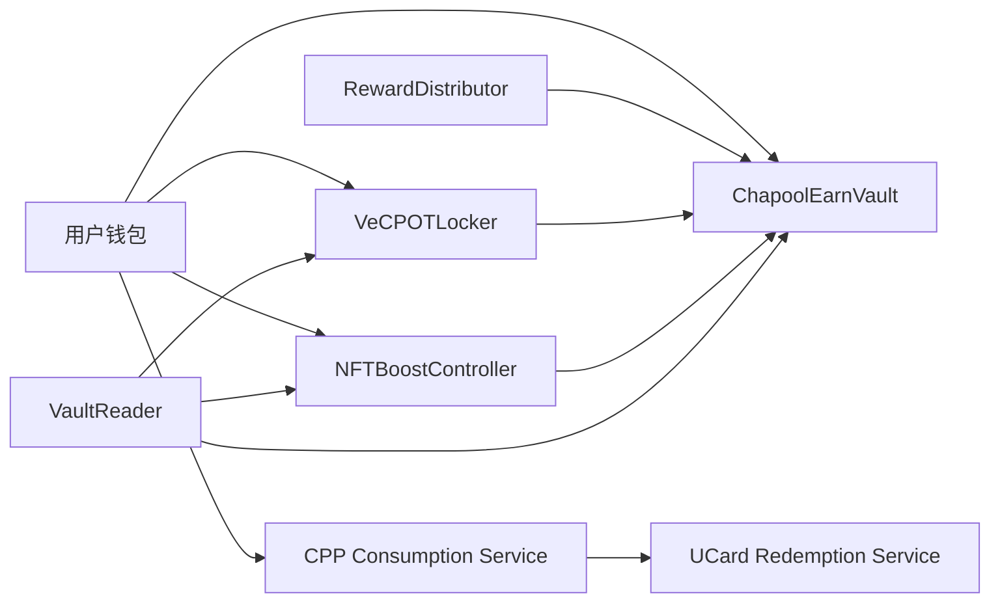

---

## 9.2 合约设计原则

### 原则 1：资金池和收益逻辑分离

不要把所有逻辑塞进一个大合约中。

执行原则：

- `Vault` 只管资金和份额
- `RewardDistributor` 只管收益注入
- `Boost` 模块只管权益计算

这样更利于：

- 升级
- 审计
- DefiLlama 接入
- 后续扩展多池子

### 原则 2：减少 `onlyOwner` 资金控制路径

如果 TVL 主池资产可以被 owner 随意提走，会严重影响协议可信度。

执行原则：

- owner 只可管理参数、暂停、白名单
- TVL 主池资产不能被 owner 任意提走
- 收益注入必须通过明确的 `depositRewards()` 路径

### 原则 3：统一事件设计

新增标准事件：

```solidity
event Deposited(address indexed user, uint256 assets, uint256 shares);
event Withdrawn(address indexed user, uint256 assets, uint256 shares);
event RewardsDeposited(address indexed sender, uint256 amount);
event LockedCPOT(address indexed user, uint256 amount, uint256 unlockTime, uint256 veAmount);
event UnlockedCPOT(address indexed user, uint256 amount);
event CPPRewardClaimed(address indexed user, uint256 amount);
event CPPRedeemedToUCard(address indexed user, uint256 cppAmount, uint256 ucardAmount);
```

这样后续：

- Dune 统计方便
- DefiLlama 接入方便
- 前端数据索引方便

---

## 🧮 十、数据模型

## 10.1 Earn 核心状态

```solidity
struct UserVaultPosition {
    uint256 shares;
    uint256 principal;
    uint256 depositedAt;
    uint256 lastActionAt;
}
```

### 全局状态

```solidity
uint256 public totalAssets;
uint256 public totalShares;
uint256 public accRewardPerShare;
address public asset; // USDT
```

## 10.2 veCPOT 状态

```solidity
struct LockPosition {
    uint256 amount;
    uint256 startTime;
    uint256 unlockTime;
}
```

## 10.3 Boost 状态

Boost 不强制存储全部状态，采用实时计算：

- `veCPOTBoostBps(user)`
- `nftBoostBps(user)`
- `combinedBoostBps(user)`

## 10.4 CPP 消费状态

```solidity
struct CPPConsumptionProfile {
    uint256 claimedRewards;
    uint256 spentInApp;
    uint256 redeemedToUCard;
    uint256 availableBalance;
}
```

---

## 🧭 十一、用户流程设计

## 11.1 首次进入产品页

### 页面应展示

- 协议 TVL
- 当前基础 APY
- 加成后最高 APY
- 已支持资产：USDT
- 风险等级：低到中
- 是否支持随取随用

### 用户理解文案

```text
存入 USDT，获得基础收益。
锁定 CPOT 或持有 CPNFT，可提升收益率。
获得的 CPP 可在站内消费，也可通过中心化服务提现到 U卡进行线下消费。
```

## 11.2 存入流程

1. 用户连接钱包
2. 输入 USDT 金额
3. 系统显示预估 APY
4. 系统展示 Boost 来源
5. 用户授权 USDT
6. 用户完成 Deposit
7. 页面显示持仓卡片

### 存入后持仓卡片展示

- 存款金额
- 当前总价值
- 可提收益
- 过去 24h 收益
- Boost 细分
- 赎回按钮

### 用户主流程图

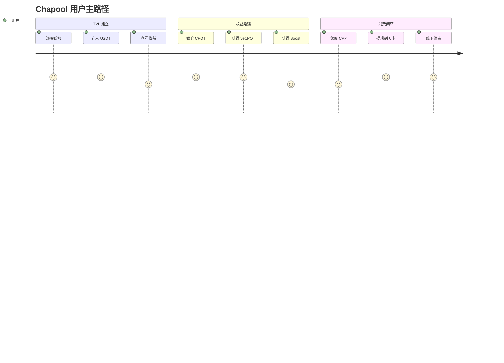

## 11.3 锁定 CPOT 流程

1. 用户进入 `veCPOT` 页
2. 选择锁仓数量与时间
3. 看到可获得的 `veCPOT`
4. 看到对应权益提升与预计 `CPP` 奖励
5. 完成锁仓

### 锁仓页核心展示

- 当前锁仓量
- 解锁时间
- 对 Earn 的 APY 加成
- Marketplace 手续费优惠
- 会员等级
- 预计 CPP 收益

## 11.4 CPP 消费 / 提现到 U卡流程

1. 用户在收益页看到可领取 `CPP`
2. 用户领取后进入 `CPP` 钱包页
3. 选择“站内消费”或“提现到 U卡”
4. 若选择 `U卡`，系统调用中心化服务展示可提现额度与到账说明
5. 用户完成兑换后，可在线下消费

## 11.5 NFT Boost 流程

Phase 2 自动识别，不额外交互。

前端展示：

- 已识别的 NFT 数量
- 生效等级
- 当前 Boost 比例

---

## 📈 十二、产品指标设计

## 12.1 核心北极星指标

### TVL 相关

- 总 TVL
- 7 日净流入
- 活期 TVL
- 定期 TVL

### 用户相关

- 存款用户数
- 首次存款转化率
- 7 日留存
- 30 日留存

### 收益相关

- 平均存款金额
- 平均持仓时长
- 平均 APY
- Boost 用户占比

### 代币相关

- CPOT 锁仓率
- veCPOT 用户数
- CPP 消费率
- CPP 提现到 U卡占比
- NFT Boost 使用率

## 12.2 Phase 1-2 目标

| 指标 | 上线后 30 天目标 |
|------|------------------|
| TVL | 100k - 300k USDT |
| 存款用户数 | 300 - 1000 |
| CPOT 锁仓占比 | 10% - 20% |
| CPP 消费或 U卡提现转化率 | 20% - 40% |
| NFT Boost 使用率 | 15% - 30% |
| 7 日留存 | > 35% |

> 注：以上是产品冷启动目标区间，具体需结合你们现有社区体量调整。

---

## 🔐 十三、风控与安全设计

## 13.1 Phase 1-3 风控原则

### 1. 只支持单资产

Phase 1-3 只支持 `USDT`，不同时支持过多资产。

原因：

- 减少价格波动问题
- 减少会计复杂度
- 降低前端理解成本
- 便于 DefiLlama 识别

### 2. 收益来源透明

必须明确区分：

- 真实收益
- 平台补贴
- CPP 激励
- CPP 到 U卡的兑付规则

避免用户误以为所有 APY 都来自真实协议收入。

### 3. 提现与资金权限严格受限

TVL 主池不应存在：

- owner 任意提现
- 后台代客挪用
- 隐式白名单提款路径

### 4. 应急暂停机制

系统支持：

- 暂停存入
- 暂停赎回
- 暂停奖励注入

同时定义清晰的应急流程和公告策略。

## 13.2 审计重点

未来如果实施，审计重点应包括：

1. 份额计算与精度问题
2. 存取款前后总资产计算
3. 奖励注入逻辑
4. 提前赎回罚金逻辑
5. veCPOT 锁仓/解锁逻辑
6. CPP 奖励结算与领取逻辑
7. CPP 到 U卡的中心化兑换/提现权限边界
8. Boost 叠加上限
9. owner 权限边界
10. UUPS 升级存储布局

### 链下风控与运营控制

围绕 `CPP -> U卡` 路径，链下系统额外承担：

- 提现审批与额度控制
- 商户与订单风控
- U卡到账重试与异常处理
- 财务对账与核销
- 用户申诉与人工介入流程

---

## 🧑‍💼 十四、运营策略

## 14.1 冷启动策略

运营按以下阶段执行：

### 阶段一：平台补贴拉新

- 活期基础 APY 由补贴托底
- 新用户前 7 天额外奖励
- 首次存款送小额 CPP

### 阶段二：Boost 驱动转化

- 锁 CPOT 获得更高收益
- 持有高等级 NFT 获得更高收益
- 做会员感和身份感

### 阶段三：消费闭环强化

- 引导用户将 `CPP` 用于站内消费或 `U卡` 提现
- 强调“奖励可消费，不只是可卖出”
- 形成线上奖励、线下消费的用户认知

### 阶段四：收益来源过渡

- 逐步把 APY 从补贴型过渡到平台收入分成型

### 冷启动到成熟期路线图

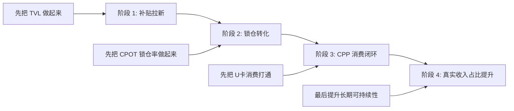

## 14.2 面向用户的包装口径

产品包装避免金融黑话，面向用户统一表述为：

- `活期赚币`
- `定期赚币`
- `锁 CPOT 升收益`
- `赚 CPP 去消费`
- `持 NFT 升等级`

### 首页卖点

```text
1. 存 USDT，获得稳定收益
2. 锁 CPOT，提升收益等级
3. 持 CPNFT，解锁额外加成
4. 赚到的 CPP 可通过中心化服务提现到 U卡线下消费
5. 协议 TVL 实时可查
```

---

## 🛣️ 十五、分阶段实施路线图

## Phase 1：`Chapool Earn MVP`

### 范围

- 单资产 USDT Vault
- Deposit / Withdraw
- TVL 展示
- 基础 APY 展示
- 简单收益注入
- 基础 Reader

### 目标

- 尽快形成真实 TVL
- 完成 DefiLlama 接入口径
- 验证用户是否愿意把 USDT 沉淀进协议

### 预估周期

- 产品设计：3-5 天
- 合约开发：5-10 天
- 前端接入：5-7 天
- 测试与修复：5-7 天

## Phase 2：`veCPOT + NFT Boost + CPP Utility`

### 范围

- CPOT 锁仓
- veCPOT 计算
- Earn APY Boost
- NFT 等级 Boost
- CPP 领取与消费入口
- CPP 到 U卡中心化兑换链路
- 前端权益展示

### 目标

- 提升留存
- 提升 `CPOT` 锁仓价值
- 提升 `CPP` 使用价值与消费转化
- 强化 NFT 资产地位

## Phase 3：`Fixed Term Earn`

### 范围

- 7/30/90 天锁仓产品
- 提前退出罚金
- 更高 APY 档位

### 目标

- 提高资金稳定性
- 提升 TVL 粘性

## Phase 4：`NFT Loan`

### 范围

- NFT 抵押借贷池
- LTV 配置
- 利率模型
- 清算逻辑

### 目标

- 打通 NFT 与稳定币流动性
- 放大协议资金使用效率

### 分阶段落地图

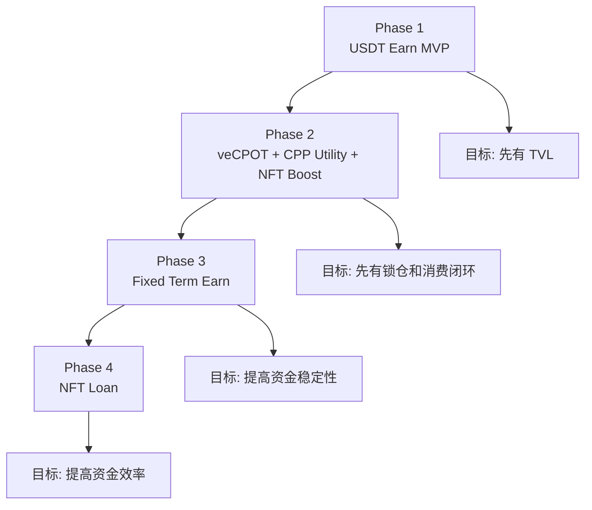

---

## ⚖️ 十六、实施边界

本方案不包含以下方向：

- 订单簿式资金撮合
- 多协议收益聚合
- 杠杆收益产品

当前实施边界的原则是：

- 优先做确定性高的 TVL 产品
- 优先做消费闭环清晰的双代币模型
- 优先做对老板、用户、DefiLlama 都容易解释的结构

---

## 🧩 十七、与现有系统的联动关系

### 与 `Staking` 的关系

- 继续保留现有 NFT 质押产品
- 将其定位为“CPP 激励模块”
- 不把它作为 TVL 主模块
- 后续可把 `Staking` 状态作为 NFT Boost 的加分条件之一

### 与 `CPOT / CPP` 双代币体系的关系

- `CPOT` 负责锁仓、会员权益、平台价值承接
- `CPP` 负责奖励、消费、U卡兑换和线下使用
- 锁仓奖励不直接增发 `CPOT`
- 推荐采用“锁 `CPOT`，赚 `CPP`，消费 `CPP`”的闭环

### 与 `Marketplace` 的关系

- Marketplace 平台费可部分注入 RewardDistributor
- 持 `veCPOT` 可享受手续费减免
- 高等级 NFT 用户可获得更高权益

### 与 `Payment` 的关系

- 不直接复用 `Payment` 作为 TVL 池
- 复用其 ERC20 收付经验和白名单思路

### 与 `AA Account` 的关系

后续增强方向：

- AA 用户一键完成授权 + 存款
- 自动续存
- 自动把奖励转为复投

这会成为产品体验亮点，但不纳入 Phase 1 核心范围。

---

## 📝 十八、MVP 需求清单

## 18.1 合约层

- [ ] `ChapoolEarnVault` 合约
- [ ] `RewardDistributor` 合约
- [ ] `VeCPOTLocker` 合约
- [ ] `VaultReader` 合约
- [ ] 统一事件设计
- [ ] 暂停机制
- [ ] 权限边界设计

## 18.2 前端层

- [ ] Earn 首页
- [ ] 存款弹窗
- [ ] 持仓页
- [ ] veCPOT 锁仓页
- [ ] CPP 收益页
- [ ] U卡提现页
- [ ] TVL / APY 展示
- [ ] 风险说明
- [ ] 交易历史

## 18.3 后端 / 服务层

- [ ] CPP 消费服务
- [ ] U卡提现服务
- [ ] 提现审批与额度控制
- [ ] 订单状态与到账回执接口
- [ ] 对账与结算后台

## 18.4 数据层

- [ ] TVL 统计
- [ ] 用户持仓统计
- [ ] APY 计算面板
- [ ] CPOT 锁仓统计
- [ ] CPP 消费与 U卡提现统计
- [ ] 资金流仪表盘
- [ ] DefiLlama 对接字段准备

## 18.5 运营层

- [ ] 收益来源说明页
- [ ] CPOT / CPP 双代币说明页
- [ ] CPP 到 U卡消费说明页
- [ ] FAQ
- [ ] 冷启动补贴方案
- [ ] 用户教育内容

---

## ✅ 十九、最终方案

### 方案结论

如果 Chapool 当前的核心目标是：

- 做出真实 TVL
- 在 DefiLlama 上获得更好的可见度
- 又不希望脱离现有 NFT / CPOT / CPP 体系

那么最合理的路线是：

1. **先做 `Chapool Earn (USDT Vault)`，把 TVL 建起来**
2. **再做 `veCPOT`，让 `CPOT` 成为平台权益与锁仓代币**
3. **让 `CPP` 承接奖励、站内消费以及通过中心化服务完成的 `U卡` 线下消费能力**
4. **再接 `NFT Boost`，让 CPNFT 变成协议会员资产**
5. **最后做 `NFT Loan`，把 NFT 金融化能力放大**

### 不纳入当前方案的路线

- 一开始做多资产复杂金库
- 先用 CPP 自己做主 TVL 产品
- 让 CPOT 锁仓收益完全依赖单一高通胀模型
- 先做过重的跨协议收益聚合

### 一句话总结

> Chapool 的 TVL 产品，应以“USDT 建 TVL、CPOT 建锁仓价值、CPP 建消费闭环、NFT 建会员加成”为主线推进。

### 最终向老板汇报时可直接使用的总图

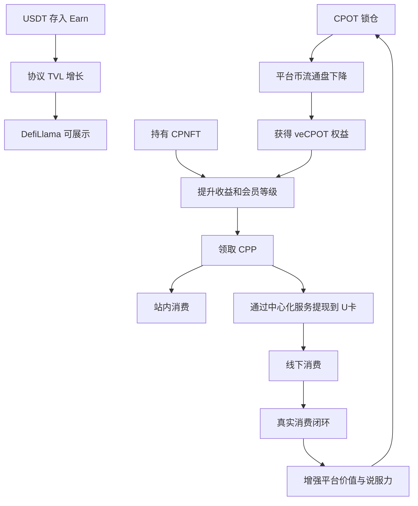

---

## 📚 二十、相关代码与文档参考

- `contracts/CPNFT/Staking.sol`
- `contracts/C2C/Marketplace.sol`
- `contracts/Payment.sol`
- `contracts/CPP/CPPToken.sol`
- `PRODUCT_DESIGN.md`
- `docs/Backend-Gas-Subsidy-Solution.md`
- `docs/Staking-RealTime-Rewards-Proposal.md`

---

**文档版本**: v1.3  
**最后更新**: 2026-03-11  
**作者**: Account Abstraction Team  
**状态**: Final
