# HzBay 跨链充值桥 — 完整技术方案

> **场景**：用户 USDT/USDC 在波场 (Tron)、Solana、Arbitrum 等链，DApp 部署在 opBNB，平台提供 opBNB USDT 流动性，用户转账到平台托管钱包后自动到账。

---

## 目录

1. [方案总览](#1-方案总览)
2. [整体架构](#2-整体架构)
3. [用户充值完整流程](#3-用户充值完整流程)
4. [地址生成策略](#4-地址生成策略)
5. [链上监听服务](#5-链上监听服务)
6. [风控与结算引擎](#6-风控与结算引擎)
7. [流动性管理](#7-流动性管理)
8. [数据库模型](#8-数据库模型)
9. [API 接口设计](#9-api-接口设计)
10. [前端交互设计](#10-前端交互设计)
11. [安全与风险控制](#11-安全与风险控制)
12. [部署架构](#12-部署架构)
13. [费率与成本模型](#13-费率与成本模型)
14. [开发里程碑](#14-开发里程碑)

---

## 1. 方案总览

### 核心思路

采用**中心化托管桥**（Custodial Deposit Bridge）模式：

- 平台在各源链持有**热钱包**作为用户专属收款地址
- 后端**监听服务**检测到账事件
- 风控通过后，**结算引擎**在 opBNB 向用户 EOA 钱包释放等值 USDT
- 平台预存 opBNB USDT 作为流动性池

### 支持的链与代币

| 源链 | 支持代币 | 确认块数 | 预计到账时间 |
|------|---------|---------|------------|
| Tron (TRC-20) | USDT、USDC | 20 块 | ~1 分钟 |
| Solana | USDT、USDC | 32 块 | ~20 秒 |
| Arbitrum | USDT、USDC | 12 块 | ~3 分钟 |
| BNB Chain | USDT、USDC | 15 块 | ~45 秒 |
| Ethereum | USDT、USDC | 12 块 | ~3 分钟 |

### 目标链

| 目标链 | 释放代币 | 来源 |
|--------|---------|------|
| opBNB | USDT (opBNB) | 平台流动性池 |

---

## 2. 整体架构

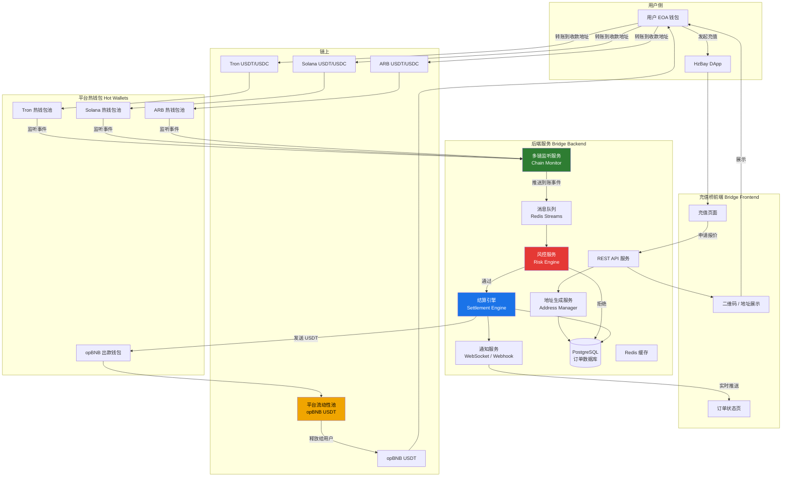

---

## 3. 用户充值完整流程

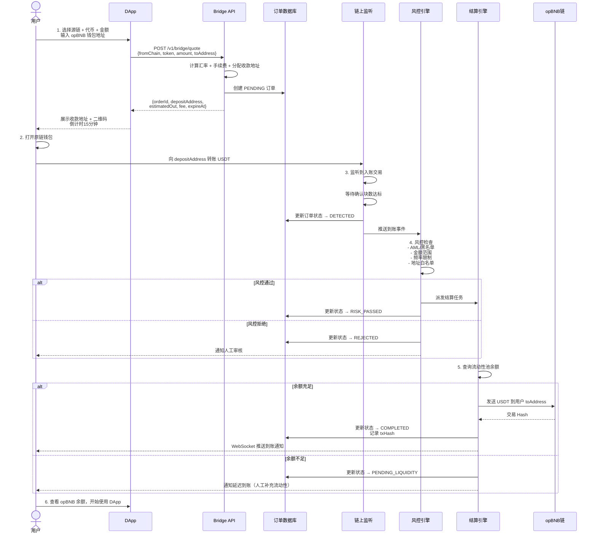

---

## 4. 地址生成策略

### 4.1 地址分配模型

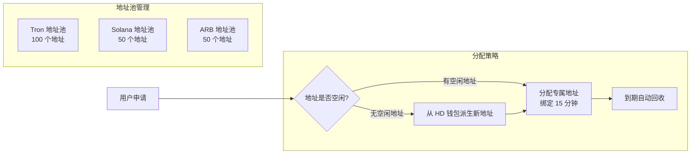

### 4.2 HD 钱包派生路径

```
主助记词 (离线保存)
└── m/44'/195'/0'/0/  (Tron)
    ├── index 0  → 地址 T1xxx (长期热钱包)
    ├── index 1  → 地址 T2xxx
    └── ...
└── m/44'/501'/0'/0/  (Solana)
    ├── index 0  → 地址 Sol1xxx
    └── ...
└── m/44'/60'/0'/0/   (ARB/EVM)
    ├── index 0  → 地址 0x1xxx
    └── ...
```

### 4.3 地址生命周期

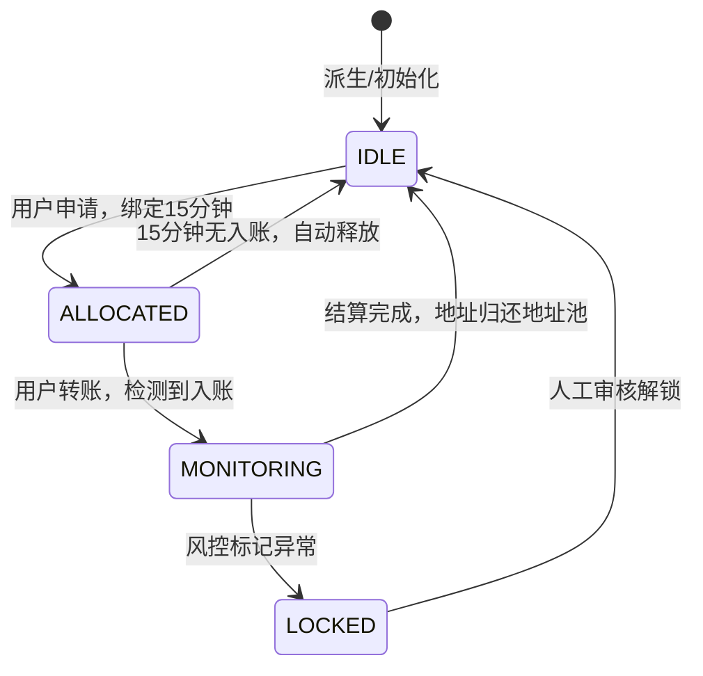

---

## 5. 链上监听服务

### 5.1 多链监听架构

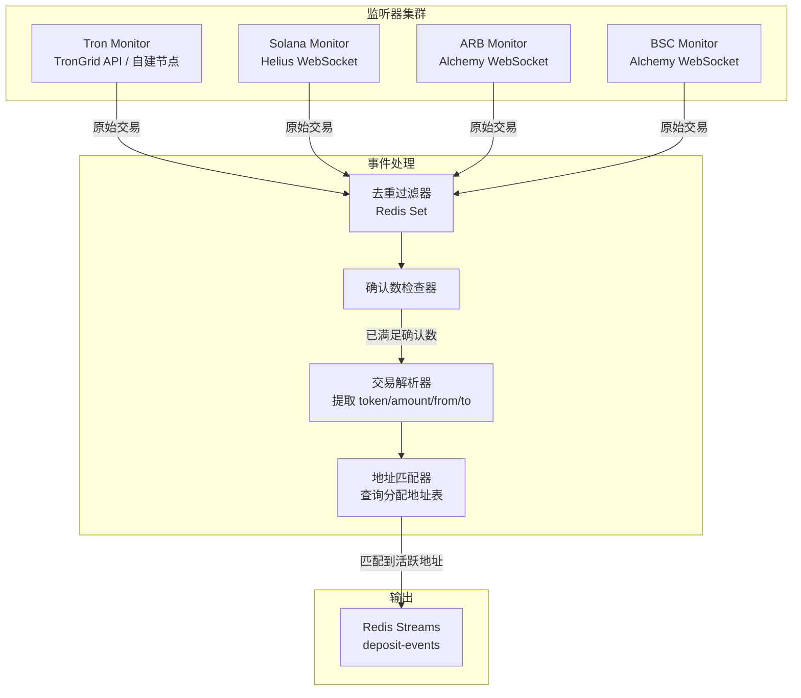

### 5.2 各链监听方式

| 链 | 监听方式 | 备选 | 延迟 |
|----|---------|------|------|
| Tron | TronGrid HTTP 轮询 (3s) | 自建全节点 | ~3s |
| Solana | Helius WebSocket logs | QuickNode | <1s |
| Arbitrum | Alchemy `eth_subscribe` | Infura | <1s |
| BSC | Alchemy WebSocket | 自建节点 | <1s |

---

## 6. 风控与结算引擎

### 6.1 风控检查流程

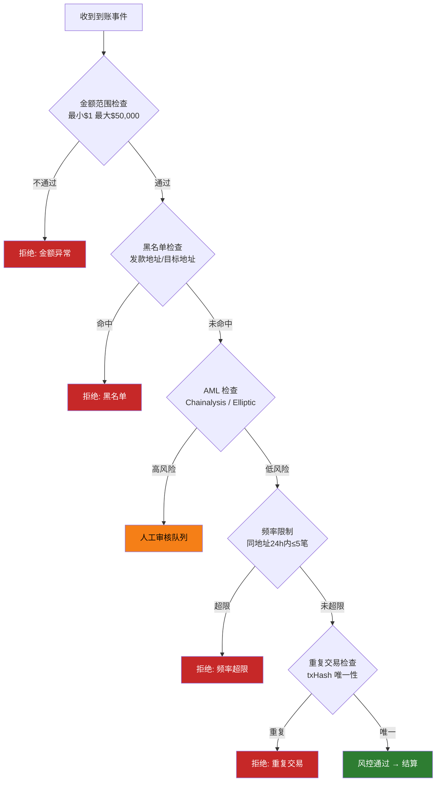

### 6.2 结算引擎状态机

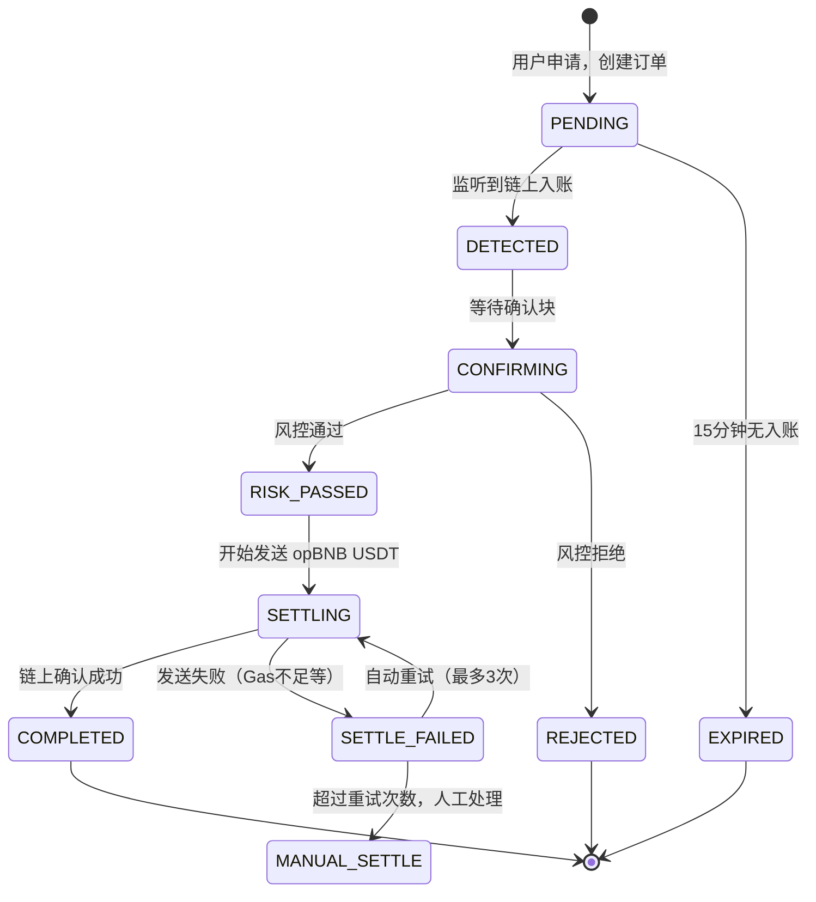

### 6.3 汇率计算

```
实际到账金额 = 用户转账金额 × 汇率 - 手续费

手续费 = max(最低手续费, 用户金额 × 费率)

例：
  转入 100 USDT (Tron)
  汇率：1:1（USDT → USDT）
  费率：0.3%，最低 $0.5
  手续费：max(0.5, 100 × 0.003) = max(0.5, 0.3) = $0.5
  实际到账：99.5 USDT (opBNB)
```

---

## 7. 流动性管理

### 7.1 流动性池架构

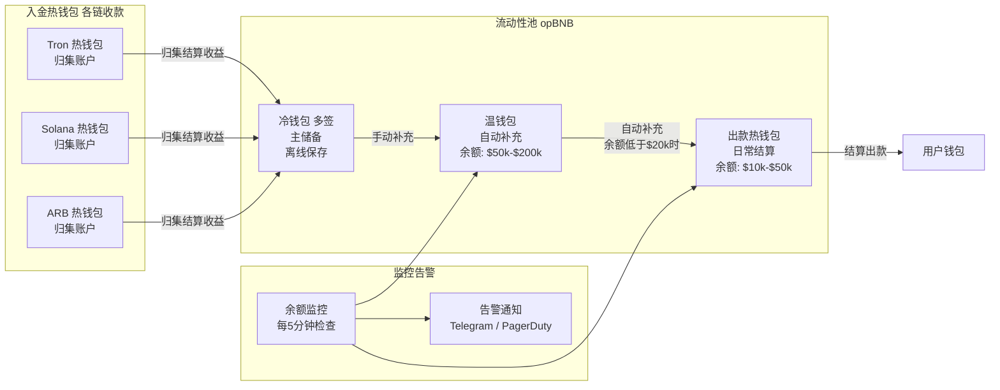

### 7.2 流动性预警阈值

| 钱包层级 | 目标余额 | 补充触发阈值 | 操作方式 |
|---------|---------|------------|---------|
| 出款热钱包 | $30,000 | < $10,000 | 自动从温钱包补充 |
| 温钱包 | $100,000 | < $30,000 | 告警通知人工从冷钱包转入 |
| 冷钱包 | $500,000+ | < $200,000 | 人工审批充值 |

---

## 8. 数据库模型

```sql
-- 订单表
CREATE TABLE deposit_orders (
    id              UUID PRIMARY KEY DEFAULT gen_random_uuid(),
    order_no        VARCHAR(32) UNIQUE NOT NULL,     -- BRG20241201XXXXXX
    
    -- 用户信息
    user_address    VARCHAR(100) NOT NULL,            -- opBNB 目标地址
    
    -- 源链信息
    from_chain      VARCHAR(20) NOT NULL,             -- tron/solana/arb/bsc
    from_token      VARCHAR(20) NOT NULL,             -- USDT/USDC
    from_amount     DECIMAL(36,18) NOT NULL,          -- 用户转入金额
    deposit_address VARCHAR(100) NOT NULL,            -- 平台收款地址
    source_tx_hash  VARCHAR(100),                     -- 用户转账哈希
    source_from     VARCHAR(100),                     -- 用户来源地址
    
    -- 目标链信息
    to_chain        VARCHAR(20) DEFAULT 'opbnb',
    to_token        VARCHAR(20) DEFAULT 'USDT',
    to_amount       DECIMAL(36,18),                  -- 实际到账金额
    settle_tx_hash  VARCHAR(100),                    -- 结算交易哈希
    
    -- 费率
    exchange_rate   DECIMAL(18,8) DEFAULT 1.0,
    fee_rate        DECIMAL(8,6)  DEFAULT 0.003,
    fee_amount      DECIMAL(36,18),
    
    -- 状态
    status          VARCHAR(30) NOT NULL DEFAULT 'PENDING',
    risk_level      VARCHAR(10),                     -- LOW/MEDIUM/HIGH
    risk_reason     TEXT,
    
    -- 时间
    expires_at      TIMESTAMPTZ NOT NULL,
    detected_at     TIMESTAMPTZ,
    settled_at      TIMESTAMPTZ,
    created_at      TIMESTAMPTZ DEFAULT NOW(),
    updated_at      TIMESTAMPTZ DEFAULT NOW()
);

-- 地址池表
CREATE TABLE deposit_addresses (
    id              UUID PRIMARY KEY DEFAULT gen_random_uuid(),
    chain           VARCHAR(20) NOT NULL,
    address         VARCHAR(100) NOT NULL,
    hd_index        INTEGER NOT NULL,
    status          VARCHAR(20) DEFAULT 'IDLE',      -- IDLE/ALLOCATED/MONITORING/LOCKED
    allocated_to    UUID REFERENCES deposit_orders(id),
    allocated_at    TIMESTAMPTZ,
    expires_at      TIMESTAMPTZ,
    created_at      TIMESTAMPTZ DEFAULT NOW(),
    UNIQUE(chain, address)
);

-- 流动性池记录
CREATE TABLE liquidity_logs (
    id              UUID PRIMARY KEY DEFAULT gen_random_uuid(),
    wallet_layer    VARCHAR(20) NOT NULL,             -- HOT/WARM/COLD
    balance_before  DECIMAL(36,18),
    balance_after   DECIMAL(36,18),
    change_amount   DECIMAL(36,18),
    change_reason   VARCHAR(100),
    related_order   UUID REFERENCES deposit_orders(id),
    created_at      TIMESTAMPTZ DEFAULT NOW()
);

-- 风控记录
CREATE TABLE risk_checks (
    id              UUID PRIMARY KEY DEFAULT gen_random_uuid(),
    order_id        UUID REFERENCES deposit_orders(id),
    check_type      VARCHAR(50),                     -- BLACKLIST/AML/FREQUENCY/AMOUNT
    result          VARCHAR(20),                     -- PASS/REJECT/MANUAL
    detail          JSONB,
    created_at      TIMESTAMPTZ DEFAULT NOW()
);
```

---

## 9. API 接口设计

### 9.1 获取报价并创建订单

```
POST /v1/bridge/quote
```

**请求**：
```json
{
  "from_chain": "tron",
  "from_token": "USDT",
  "amount": "100",
  "to_address": "0xUserOpBNBAddress"
}
```

**响应**：
```json
{
  "order_id": "BRG20241201ABCD1234",
  "deposit_address": "TXxxxxxxxxxxxxxx",
  "from_chain": "tron",
  "from_token": "USDT",
  "input_amount": "100",
  "fee_amount": "0.5",
  "estimated_output": "99.5",
  "exchange_rate": "1.0",
  "to_address": "0xUserOpBNBAddress",
  "expires_at": "2024-12-01T12:15:00Z",
  "min_confirmations": 20,
  "qr_code": "data:image/png;base64,..."
}
```

### 9.2 查询订单状态

```
GET /v1/bridge/order/:order_id
```

**响应**：
```json
{
  "order_id": "BRG20241201ABCD1234",
  "status": "COMPLETED",
  "source_tx_hash": "用户转账哈希",
  "settle_tx_hash": "opBNB结算哈希",
  "from_amount": "100",
  "to_amount": "99.5",
  "settled_at": "2024-12-01T12:03:45Z"
}
```

### 9.3 WebSocket 实时状态推送

```
WS /v1/bridge/ws/:order_id
```

**服务端推送事件**：
```json
{ "event": "DETECTED",   "message": "检测到入账，等待确认..." }
{ "event": "CONFIRMING", "message": "已确认 12/20 块..." }
{ "event": "SETTLING",   "message": "正在发送 opBNB USDT..." }
{ "event": "COMPLETED",  "message": "到账成功！", "tx_hash": "0x..." }
```

### 9.4 获取支持的链和汇率

```
GET /v1/bridge/chains
```

**响应**：
```json
{
  "chains": [
    {
      "chain_id": "tron",
      "name": "Tron",
      "tokens": ["USDT", "USDC"],
      "fee_rate": 0.003,
      "min_amount": 1,
      "max_amount": 50000,
      "estimated_time_minutes": 1,
      "min_confirmations": 20
    }
  ]
}
```

---

## 10. 前端交互设计

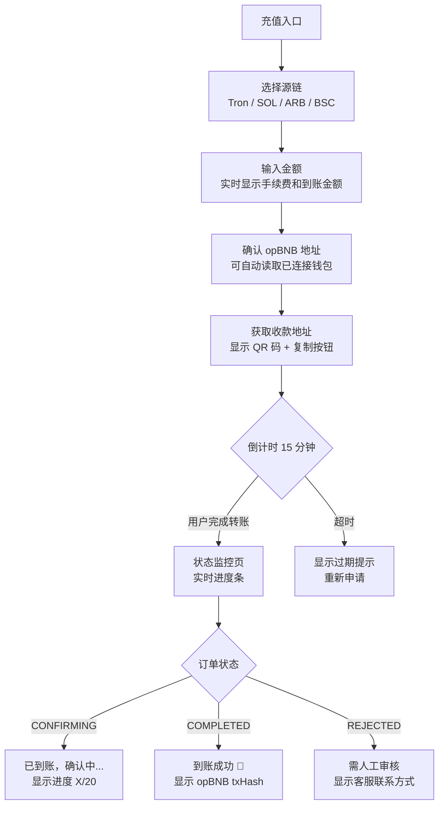

---

## 11. 安全与风险控制

### 11.1 私钥安全

```
推荐方案（按安全级别）：

1. 最高安全（生产推荐）
   ├── AWS KMS / GCP Cloud HSM 托管主私钥
   ├── 应用层只持有派生路径，无法导出原始私钥
   └── 签名操作在 KMS 内执行，私钥永不离开 HSM

2. 高安全（中等规模）
   ├── 出款热钱包私钥加密存储于 HashiCorp Vault
   ├── 每次结算从 Vault 动态获取，TTL 30分钟
   └── 审计日志记录每次私钥访问

3. 多签（大额出款）
   ├── 单笔超过 $5,000 需要 2/3 多签确认
   └── 冷钱包补充使用 Gnosis Safe
```

### 11.2 运营风险矩阵

| 风险 | 概率 | 影响 | 缓解措施 |
|------|------|------|---------|
| 流动性不足 | 中 | 高 | 多层钱包架构 + 余额监控告警 |
| 私钥泄露 | 低 | 极高 | HSM + 多签 + 最小权限原则 |
| 链上拥堵结算延迟 | 中 | 中 | 动态 Gas 策略 + EIP-1559 |
| 监听服务宕机 | 低 | 高 | 多节点冗余 + 断点续扫 |
| 用户重复提交 | 高 | 中 | txHash 唯一性检查 |
| AML 合规风险 | 中 | 极高 | 接入 Chainalysis + 限额 + KYC |
| 汇率波动（USDC≠USDT） | 中 | 中 | 实时喂价 + 价格偏差保护 |

### 11.3 合规要求

- **KYC**：单笔超过 $10,000 需要身份验证
- **AML**：接入 Chainalysis KYT 或 Elliptic 进行地址风险评分
- **日志留存**：所有交易记录保存 5 年
- **限额**：
  - 单次：最小 $1，最大 $50,000
  - 日限额：单用户 $100,000
  - 月限额：单用户 $500,000

---

## 12. 部署架构

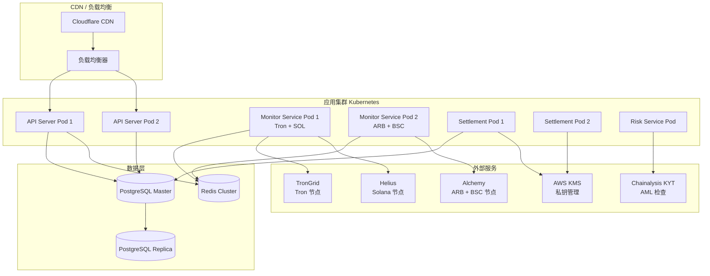

### 基础设施配置

| 组件 | 规格 | 数量 | 月成本估算 |
|------|------|------|-----------|
| API Server | 2vCPU / 4GB | 2 | $80 |
| Monitor Service | 2vCPU / 4GB | 2 | $80 |
| Settlement Service | 2vCPU / 4GB | 2 | $80 |
| PostgreSQL | 4vCPU / 16GB | 1主1从 | $200 |
| Redis | 2vCPU / 8GB | 集群 | $100 |
| Alchemy / Helius | 按量付费 | - | $200 |
| Chainalysis KYT | 按量付费 | - | $500+ |
| **合计** | | | **~$1,240/月** |

---

## 13. 费率与成本模型

### 13.1 平台收费结构

```
手续费 = max(链路成本 + 利润, 最低费用)

各链成本估算（单笔）：
  Tron   → opBNB：$0.10（Tron 几乎免费 + opBNB Gas $0.001）
  Solana → opBNB：$0.01（SOL Gas）+ opBNB Gas $0.001
  ARB    → opBNB：$0.20（ARB Gas）+ opBNB Gas $0.001
  ETH    → opBNB：$3~10（ETH Gas 波动大）

建议费率：
  Tron：0.3% 或最低 $0.5
  Solana：0.3% 或最低 $0.5
  ARB：0.5% 或最低 $1.0
  ETH：0.8% 或最低 $5.0
```

### 13.2 收益模型示例

```
假设：日充值 $100,000（均值每笔 $500，200 笔/天）

收入：$100,000 × 0.3% = $300/天 = $9,000/月

成本：
  基础设施：$1,240/月
  Gas 费：$200/月（估算）
  AML 服务：$500/月
  运营：$500/月
  合计：$2,440/月

净利润：约 $6,560/月（以上为估算，实际以业务量为准）
```

---

## 14. 开发里程碑

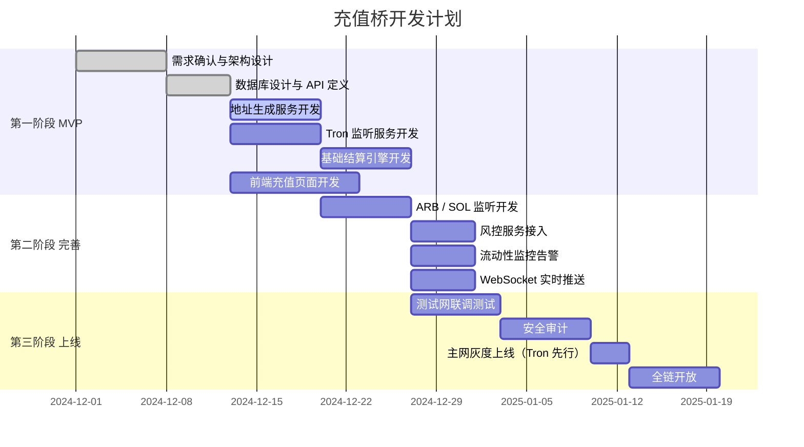

### 各阶段交付物

| 阶段 | 时间 | 交付物 |
|------|------|--------|
| MVP | 第 1-3 周 | Tron → opBNB 充值通道，基础风控 |
| 完善 | 第 4-5 周 | 全链支持，流动性监控，AML 接入 |
| 上线 | 第 6-8 周 | 安全审计，灰度上线，全链开放 |

---

## 附录：技术选型建议

| 模块 | 推荐方案 | 备选方案 |
|------|---------|---------|
| 后端框架 | Go (go-starter) | Node.js + TypeScript |
| 消息队列 | Redis Streams | RabbitMQ |
| 私钥管理 | AWS KMS | HashiCorp Vault |
| Tron 节点 | TronGrid API | 自建 FullNode |
| Solana 节点 | Helius | QuickNode |
| ARB/EVM 节点 | Alchemy | Infura |
| AML 服务 | Chainalysis KYT | Elliptic |
| 监控告警 | Grafana + PagerDuty | Datadog |
| 部署 | Kubernetes (AWS EKS) | Docker Compose (初期) |

---

*最后更新：2024-12-01*  
*文档版本：v1.0*  
*维护团队：HzBay 基础设施组*
