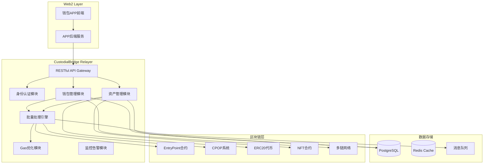

# CustodialBridge - 通用钱包Relayer设计文档

## 项目概述

**CustodialBridge** 是基于CPOP账户抽象技术栈构建的通用钱包Relayer服务，为Web2开发者提供托管式区块链资产管理的桥接服务。

### 项目目标

1. **抽象层**：封装所有区块链复杂性，提供纯RESTful API
2. **多链支持**：统一管理ETH、BSC、Polygon等主流区块链资产
3. **Gas优化**：继承CPOP批量处理机制，实现极致Gas节省
4. **开发者友好**：让Web2开发者像调用传统API一样使用区块链功能

### 技术栈

- **后端框架**: Go (基于go-starter模板)
- **数据库**: PostgreSQL + Redis
- **区块链**: 基于CPOP账户抽象系统
- **API风格**: RESTful + WebSocket (实时通知)
- **部署**: Docker + Kubernetes

## 系统架构

### 整体架构图



### 核心模块设计

#### 1. 钱包管理模块 (WalletManager)

```go
type WalletManager struct {
    deploymentQueue  *DeploymentQueue
    multiChainConfig map[int64]*ChainConfig
    aaFactory        *AAWalletFactory
}

// 支持的链配置
type ChainConfig struct {
    ChainID      int64  `json:"chain_id"`
    Name         string `json:"name"`
    RPCUrl       string `json:"rpc_url"`
    EntryPoint   string `json:"entry_point"`
    GasToken     string `json:"gas_token"`
    IsEnabled    bool   `json:"is_enabled"`
}

// 默认支持的链
var DefaultChains = []ChainConfig{
    {ChainID: 1, Name: "Ethereum", GasToken: "ETH"},
    {ChainID: 56, Name: "BSC", GasToken: "BNB"},
    {ChainID: 137, Name: "Polygon", GasToken: "MATIC"},
    {ChainID: 42161, Name: "Arbitrum", GasToken: "ETH"},
}
```

#### 2. 资产管理模块 (AssetManager)

```go
type AssetManager struct {
    // 继承CPOP的积分管理
    CPOPManager    *CPOPBalanceManager
    
    // 新增通用资产管理
    ETHManager     *NativeTokenManager
    ERC20Manager   *ERC20TokenManager
    NFTManager     *NFTAssetManager
    MultiChain     *MultiChainManager
    PriceFeed      *PriceFeedManager
}

// 支持的资产类型
type AssetType string
const (
    ASSET_CPOP   AssetType = "CPOP"     // CPOP积分
    ASSET_ETH    AssetType = "ETH"      // 原生代币
    ASSET_ERC20  AssetType = "ERC20"    // ERC20代币
    ASSET_NFT    AssetType = "NFT"      // NFT资产
)
```

#### 3. 批量处理引擎 (BatchProcessor)

```go
type BatchProcessor struct {
    pendingOps       []Operation
    batchSize        int // 默认50
    maxWaitTime      time.Duration // 15秒
    chainProcessors  map[int64]*ChainProcessor
}

type Operation struct {
    ID           string    `json:"id"`
    UserID       string    `json:"user_id"`
    ChainID      int64     `json:"chain_id"`
    Type         string    `json:"type"`         // transfer, mint, burn, deploy
    AssetType    AssetType `json:"asset_type"`
    Amount       string    `json:"amount"`
    FromAddress  string    `json:"from_address"`
    ToAddress    string    `json:"to_address"`
    ContractAddr string    `json:"contract_address"`
    Metadata     string    `json:"metadata"`
    Priority     int       `json:"priority"`    // 1-5, 5为最高
    CreatedAt    time.Time `json:"created_at"`
}

// 批量处理触发条件
func (bp *BatchProcessor) AddOperation(op Operation) {
    bp.pendingOps = append(bp.pendingOps, op)
    
    // 触发条件：数量达到阈值或等待超时
    if len(bp.pendingOps) >= bp.batchSize || bp.shouldProcessImmediately(op) {
        go bp.ProcessBatch()
    } else if bp.timer == nil {
        bp.timer = time.AfterFunc(bp.maxWaitTime, bp.ProcessBatch)
    }
}
```

## API接口设计

### 1. 钱包管理API

#### 获取用户钱包信息
```http
GET /api/v1/wallet/{user_id}
```

**响应示例**:
```json
{
  "user_id": "user_123",
  "wallets": [
    {
      "chain_id": 1,
      "chain_name": "Ethereum",
      "aa_address": "0x1234567890123456789012345678901234567890",
      "is_deployed": true,
      "deployment_tx": "0xabc123...",
      "master_signer": "0x5678901234567890123456789012345678901234"
    },
    {
      "chain_id": 56,
      "chain_name": "BSC", 
      "aa_address": "0x5678901234567890123456789012345678901234",
      "is_deployed": false,
      "estimated_deploy_time": 30
    }
  ]
}
```

#### 部署钱包到指定链
```http
POST /api/v1/wallet/{user_id}/deploy
```

**请求体**:
```json
{
  "chain_id": 1,
  "priority": "normal"  // normal, high
}
```

**响应示例**:
```json
{
  "transaction_id": "deploy_tx_123",
  "status": "pending",
  "estimated_confirmation": 45,
  "aa_address": "0x1234567890123456789012345678901234567890"
}
```

### 2. 资产查询API

#### 获取用户所有资产
```http
GET /api/v1/assets/{user_id}
```

**Query参数**:
- `chain_id` (可选): 指定链ID
- `include_nft` (可选): 是否包含NFT，默认false

**响应示例**:
```json
{
  "user_id": "user_123",
  "total_value_usd": 1250.50,
  "last_updated": "2024-01-15T10:30:00Z",
  "assets": [
    {
      "chain_id": 1,
      "chain_name": "Ethereum",
      "asset_type": "ETH",
      "symbol": "ETH",
      "name": "Ethereum",
      "balance": "1.500000000000000000",
      "balance_usd": 3000.0,
      "contract_address": null,
      "decimals": 18
    },
    {
      "chain_id": 1,
      "chain_name": "Ethereum",
      "asset_type": "ERC20",
      "symbol": "USDT",
      "name": "Tether USD",
      "balance": "1000.000000",
      "balance_usd": 1000.0,
      "contract_address": "0xdAC17F958D2ee523a2206206994597C13D831ec7",
      "decimals": 6
    },
    {
      "chain_id": 1,
      "chain_name": "Ethereum",
      "asset_type": "CPOP",
      "symbol": "CPOP",
      "name": "CPOP Token",
      "balance": "5000.000000000000000000",
      "balance_usd": 250.0,
      "contract_address": "0x...",
      "decimals": 18
    }
  ],
  "nfts": [
    {
      "chain_id": 1,
      "collection_name": "CryptoPunks",
      "contract_address": "0xb47e3cd837ddf8e4c57f05d70ab865de6e193bbb",
      "token_id": "123",
      "name": "CryptoPunk #123",
      "description": "A unique CryptoPunk",
      "image": "https://www.larvalabs.com/cryptopunks/cryptopunk123.png",
      "estimated_value_usd": 50000,
      "metadata": {
        "attributes": [
          {"trait_type": "Type", "value": "Human"},
          {"trait_type": "Hat", "value": "Bandana"}
        ]
      }
    }
  ]
}
```

#### 获取特定资产余额
```http
GET /api/v1/assets/{user_id}/balance
```

**Query参数**:
- `chain_id` (必需): 链ID
- `asset_type` (必需): 资产类型 (ETH, ERC20, CPOP)
- `contract_address` (ERC20时必需): 合约地址

**响应示例**:
```json
{
  "user_id": "user_123",
  "chain_id": 1,
  "asset_type": "ERC20",
  "symbol": "USDT",
  "balance": "1000.000000",
  "balance_usd": 1000.0,
  "pending_balance": "50.000000",
  "available_balance": "950.000000",
  "last_updated": "2024-01-15T10:30:00Z"
}
```

### 3. 转账操作API

#### 通用转账接口
```http
POST /api/v1/transfer
```

**请求体**:
```json
{
  "from_user_id": "user_123",
  "to_address": "0x1234567890123456789012345678901234567890",
  "chain_id": 1,
  "asset_type": "ERC20",
  "contract_address": "0xdAC17F958D2ee523a2206206994597C13D831ec7",
  "amount": "100.500000",
  "memo": "转账备注",
  "gas_mode": "sponsored",     // sponsored(代付) 或 self(自付)
  "priority": "normal"         // low, normal, high
}
```

**响应示例**:
```json
{
  "transaction_id": "tx_abc123456",
  "status": "pending",
  "estimated_confirmation": 45,
  "gas_fee_usd": 2.5,
  "from_address": "0x5678901234567890123456789012345678901234",
  "to_address": "0x1234567890123456789012345678901234567890",
  "explorer_url": "https://etherscan.io/tx/",
  "batch_info": {
    "will_be_batched": true,
    "estimated_batch_time": 15,
    "current_batch_size": 23
  }
}
```

#### 用户间转账（P2P）
```http
POST /api/v1/transfer/p2p
```

**请求体**:
```json
{
  "from_user_id": "user_123",
  "to_user_id": "user_456",
  "chain_id": 1,
  "asset_type": "CPOP",
  "amount": "50.000000000000000000",
  "memo": "朋友转账"
}
```

#### 批量转账
```http
POST /api/v1/transfer/batch
```

**请求体**:
```json
{
  "from_user_id": "user_123",
  "transfers": [
    {
      "to_address": "0x1234567890123456789012345678901234567890",
      "chain_id": 1,
      "asset_type": "ERC20",
      "contract_address": "0xdAC17F958D2ee523a2206206994597C13D831ec7",
      "amount": "100.000000",
      "memo": "批量转账1"
    },
    {
      "to_user_id": "user_456",
      "chain_id": 1,
      "asset_type": "CPOP",
      "amount": "50.000000000000000000",
      "memo": "批量转账2"
    }
  ],
  "gas_mode": "sponsored"
}
```

### 4. NFT操作API

#### 获取用户NFT列表
```http
GET /api/v1/nft/{user_id}
```

**Query参数**:
- `chain_id` (可选): 链ID
- `contract_address` (可选): 合约地址
- `limit` (可选): 限制数量，默认20
- `offset` (可选): 偏移量，默认0

#### NFT转账
```http
POST /api/v1/nft/transfer
```

**请求体**:
```json
{
  "from_user_id": "user_123",
  "to_address": "0x1234567890123456789012345678901234567890",
  "chain_id": 1,
  "contract_address": "0xb47e3cd837ddf8e4c57f05d70ab865de6e193bbb",
  "token_id": "123",
  "amount": 1,  // ERC1155时可能大于1
  "gas_mode": "sponsored"
}
```

### 5. 交易历史API

#### 获取交易历史
```http
GET /api/v1/transactions/{user_id}
```

**Query参数**:
- `chain_id` (可选): 链ID
- `asset_type` (可选): 资产类型
- `status` (可选): 交易状态
- `from_date` (可选): 开始时间
- `to_date` (可选): 结束时间
- `limit` (可选): 限制数量，默认20
- `offset` (可选): 偏移量，默认0

**响应示例**:
```json
{
  "transactions": [
    {
      "transaction_id": "tx_abc123456",
      "chain_id": 1,
      "chain_name": "Ethereum",
      "type": "transfer_out",
      "asset_type": "ERC20",
      "symbol": "USDT",
      "amount": "100.000000",
      "from_address": "0x5678901234567890123456789012345678901234",
      "to_address": "0x1234567890123456789012345678901234567890",
      "status": "confirmed",
      "tx_hash": "0xdef456...",
      "block_number": 18500000,
      "gas_fee": "0.005000000000000000",
      "gas_fee_usd": 2.5,
      "timestamp": "2024-01-15T10:30:00Z",
      "memo": "转账备注",
      "batch_info": {
        "batch_id": "batch_xyz789",
        "batch_size": 25,
        "gas_saved_percentage": 76.5
      }
    }
  ],
  "pagination": {
    "total": 150,
    "limit": 20,
    "offset": 0,
    "has_next": true
  }
}
```

#### 查询特定交易状态
```http
GET /api/v1/transaction/{transaction_id}
```

**响应示例**:
```json
{
  "transaction_id": "tx_abc123456",
  "status": "confirmed",
  "tx_hash": "0xdef456...",
  "block_number": 18500000,
  "confirmations": 12,
  "timestamp": "2024-01-15T10:30:00Z",
  "gas_used": 21000,
  "gas_fee": "0.005000000000000000",
  "gas_fee_usd": 2.5,
  "explorer_url": "https://etherscan.io/tx/0xdef456..."
}
```

### 6. 系统管理API

#### 获取支持的链列表
```http
GET /api/v1/chains
```

#### 获取支持的代币列表
```http
GET /api/v1/tokens
```

**Query参数**:
- `chain_id` (可选): 链ID

#### 系统状态检查
```http
GET /api/v1/health
```

**响应示例**:
```json
{
  "status": "healthy",
  "version": "1.0.0",
  "uptime": 86400,
  "components": {
    "database": "healthy",
    "redis": "healthy",
    "ethereum_rpc": "healthy",
    "bsc_rpc": "healthy",
    "batch_processor": "healthy"
  },
  "metrics": {
    "pending_operations": 142,
    "average_confirmation_time": 14.2,
    "success_rate_24h": 99.88,
    "gas_saved_percentage": 78.5
  }
}
```

## 数据库设计

### 1. 用户钱包表

```sql
-- 用户多链钱包表
CREATE TABLE user_wallets (
    id SERIAL PRIMARY KEY,
    user_id UUID NOT NULL,
    chain_id BIGINT NOT NULL,
    aa_address CHAR(42) NOT NULL,
    is_deployed BOOLEAN DEFAULT FALSE,
    deployment_tx_hash CHAR(66),
    master_signer CHAR(42),
    created_at TIMESTAMP DEFAULT NOW(),
    updated_at TIMESTAMP DEFAULT NOW(),
    
    UNIQUE(user_id, chain_id),
    INDEX idx_user_chain (user_id, chain_id),
    INDEX idx_aa_address (aa_address)
);
```

### 2. 链配置表

```sql
-- 支持的区块链配置表
CREATE TABLE chains (
    chain_id BIGINT PRIMARY KEY,
    name VARCHAR(50) NOT NULL,
    rpc_url VARCHAR(255) NOT NULL,
    explorer_url VARCHAR(255),
    entry_point_address CHAR(42),
    gas_token_symbol VARCHAR(10) NOT NULL,
    gas_token_decimals INT DEFAULT 18,
    is_enabled BOOLEAN DEFAULT TRUE,
    block_time_seconds INT DEFAULT 12,
    gas_price_gwei BIGINT DEFAULT 20,
    created_at TIMESTAMP DEFAULT NOW()
);

-- 初始化数据
INSERT INTO chains (chain_id, name, rpc_url, explorer_url, entry_point_address, gas_token_symbol) VALUES
(1, 'Ethereum', 'https://mainnet.infura.io/v3/YOUR_KEY', 'https://etherscan.io', '0x4337084d9e255ff0702461cf8895ce9e3b5ff108', 'ETH'),
(56, 'BSC', 'https://bsc-dataseed1.binance.org', 'https://bscscan.com', '0x4337084d9e255ff0702461cf8895ce9e3b5ff108', 'BNB'),
(137, 'Polygon', 'https://polygon-rpc.com', 'https://polygonscan.com', '0x4337084d9e255ff0702461cf8895ce9e3b5ff108', 'MATIC'),
(42161, 'Arbitrum', 'https://arb1.arbitrum.io/rpc', 'https://arbiscan.io', '0x4337084d9e255ff0702461cf8895ce9e3b5ff108', 'ETH');
```

### 3. 代币配置表

```sql
-- 支持的代币表
CREATE TABLE supported_tokens (
    id SERIAL PRIMARY KEY,
    chain_id BIGINT NOT NULL,
    contract_address CHAR(42),  -- NULL for native tokens
    symbol VARCHAR(20) NOT NULL,
    name VARCHAR(100) NOT NULL,
    decimals INT NOT NULL,
    is_native BOOLEAN DEFAULT FALSE,
    price_feed_id VARCHAR(50),  -- CoinGecko价格源ID
    icon_url VARCHAR(255),
    is_enabled BOOLEAN DEFAULT TRUE,
    created_at TIMESTAMP DEFAULT NOW(),
    
    UNIQUE(chain_id, contract_address),
    FOREIGN KEY (chain_id) REFERENCES chains(chain_id),
    INDEX idx_chain_symbol (chain_id, symbol)
);

-- 初始化主要代币
INSERT INTO supported_tokens (chain_id, contract_address, symbol, name, decimals, is_native, price_feed_id) VALUES
-- Ethereum
(1, NULL, 'ETH', 'Ethereum', 18, TRUE, 'ethereum'),
(1, '0xdAC17F958D2ee523a2206206994597C13D831ec7', 'USDT', 'Tether USD', 6, FALSE, 'tether'),
(1, '0xA0b86a33E6441E539A87f8c18ce4d2FC4e2F4C32', 'USDC', 'USD Coin', 6, FALSE, 'usd-coin'),
-- BSC
(56, NULL, 'BNB', 'BNB', 18, TRUE, 'binancecoin'),
(56, '0x55d398326f99059fF775485246999027B3197955', 'USDT', 'Tether USD', 18, FALSE, 'tether'),
-- Polygon
(137, NULL, 'MATIC', 'Polygon', 18, TRUE, 'matic-network');
```

### 4. 用户资产余额表

```sql
-- 用户资产余额表
CREATE TABLE user_balances (
    id SERIAL PRIMARY KEY,
    user_id UUID NOT NULL,
    chain_id BIGINT NOT NULL,
    token_id INT NOT NULL,
    balance NUMERIC(36,18) DEFAULT 0,
    pending_balance NUMERIC(36,18) DEFAULT 0,  -- 待确认变动
    last_updated TIMESTAMP DEFAULT NOW(),
    
    UNIQUE(user_id, chain_id, token_id),
    FOREIGN KEY (chain_id) REFERENCES chains(chain_id),
    FOREIGN KEY (token_id) REFERENCES supported_tokens(id),
    INDEX idx_user_balances (user_id, chain_id),
    INDEX idx_balance_updates (last_updated)
);
```

### 5. NFT相关表

```sql
-- NFT集合表
CREATE TABLE nft_collections (
    id SERIAL PRIMARY KEY,
    chain_id BIGINT NOT NULL,
    contract_address CHAR(42) NOT NULL,
    name VARCHAR(100) NOT NULL,
    symbol VARCHAR(20),
    token_type ENUM('ERC721', 'ERC1155') NOT NULL,
    description TEXT,
    metadata_base_uri TEXT,
    icon_url VARCHAR(255),
    is_verified BOOLEAN DEFAULT FALSE,
    floor_price NUMERIC(18,8),
    total_supply BIGINT,
    created_at TIMESTAMP DEFAULT NOW(),
    
    UNIQUE(chain_id, contract_address),
    FOREIGN KEY (chain_id) REFERENCES chains(chain_id),
    INDEX idx_chain_collections (chain_id, is_verified)
);

-- 用户NFT资产表
CREATE TABLE user_nfts (
    id SERIAL PRIMARY KEY,
    user_id UUID NOT NULL,
    collection_id INT NOT NULL,
    token_id VARCHAR(78) NOT NULL,  -- 支持大整数
    amount INT DEFAULT 1,  -- ERC1155数量
    metadata JSONB,        -- NFT元数据缓存
    image_url VARCHAR(255),
    estimated_value_usd NUMERIC(18,2),
    last_updated TIMESTAMP DEFAULT NOW(),
    
    UNIQUE(user_id, collection_id, token_id),
    FOREIGN KEY (collection_id) REFERENCES nft_collections(id),
    INDEX idx_user_nfts (user_id, collection_id),
    INDEX idx_nft_value (estimated_value_usd DESC)
);
```

### 6. 交易记录表

```sql
-- 通用交易表
CREATE TABLE universal_transactions (
    id SERIAL PRIMARY KEY,
    tx_id UUID UNIQUE NOT NULL,
    user_id UUID NOT NULL,
    chain_id BIGINT NOT NULL,
    tx_type ENUM('transfer_in', 'transfer_out', 'mint', 'burn', 'deploy', 'nft_transfer_in', 'nft_transfer_out') NOT NULL,
    
    -- 资产信息
    asset_type ENUM('native', 'erc20', 'nft', 'cpop') NOT NULL,
    token_id INT,  -- 关联supported_tokens
    collection_id INT,  -- 关联nft_collections
    contract_address CHAR(42),
    token_id_nft VARCHAR(78),  -- NFT token ID
    amount NUMERIC(36,18),
    amount_usd NUMERIC(18,2),
    
    -- 交易地址
    from_address CHAR(42),
    to_address CHAR(42),
    
    -- 状态信息
    status ENUM('pending', 'submitted', 'confirmed', 'failed') DEFAULT 'pending',
    tx_hash CHAR(66),
    block_number BIGINT,
    gas_used BIGINT,
    gas_price NUMERIC(36,18),
    gas_fee_native NUMERIC(36,18),  -- 原生代币gas费
    gas_fee_usd NUMERIC(10,2),      -- USD gas费
    
    -- 批量信息
    batch_id UUID,
    batch_position INT,
    gas_saved_percentage NUMERIC(5,2),  -- Gas节省百分比
    
    -- 元数据
    memo TEXT,
    error_message TEXT,
    retry_count INT DEFAULT 0,
    priority INT DEFAULT 3,  -- 1-5
    created_at TIMESTAMP DEFAULT NOW(),
    updated_at TIMESTAMP DEFAULT NOW(),
    confirmed_at TIMESTAMP,
    
    FOREIGN KEY (chain_id) REFERENCES chains(chain_id),
    FOREIGN KEY (token_id) REFERENCES supported_tokens(id),
    FOREIGN KEY (collection_id) REFERENCES nft_collections(id),
    INDEX idx_user_txs (user_id, chain_id, created_at DESC),
    INDEX idx_tx_hash (tx_hash),
    INDEX idx_status_time (status, created_at),
    INDEX idx_batch (batch_id, batch_position)
);
```

### 7. 批量处理表

```sql
-- 批量操作表
CREATE TABLE batches (
    id SERIAL PRIMARY KEY,
    batch_id UUID UNIQUE NOT NULL,
    chain_id BIGINT NOT NULL,
    bundle_tx_hash CHAR(66),
    status ENUM('pending', 'submitted', 'confirmed', 'failed') DEFAULT 'pending',
    operation_count INT NOT NULL,
    total_gas_estimate BIGINT,
    actual_gas_used BIGINT,
    gas_saved BIGINT,
    gas_saved_percentage NUMERIC(5,2),
    operations JSONB,  -- 操作详情
    error_message TEXT,
    created_at TIMESTAMP DEFAULT NOW(),
    submitted_at TIMESTAMP,
    confirmed_at TIMESTAMP,
    
    FOREIGN KEY (chain_id) REFERENCES chains(chain_id),
    INDEX idx_batch_status (status, created_at),
    INDEX idx_chain_batches (chain_id, confirmed_at DESC)
);
```

### 8. 系统配置表

```sql
-- 系统配置表
CREATE TABLE system_configs (
    id SERIAL PRIMARY KEY,
    config_key VARCHAR(100) UNIQUE NOT NULL,
    config_value TEXT NOT NULL,
    description TEXT,
    is_encrypted BOOLEAN DEFAULT FALSE,
    updated_at TIMESTAMP DEFAULT NOW()
);

-- 初始化配置
INSERT INTO system_configs (config_key, config_value, description) VALUES
('batch_size_default', '50', '默认批量处理大小'),
('batch_timeout_seconds', '15', '批量处理超时时间(秒)'),
('gas_price_buffer_percent', '15', 'Gas价格缓冲百分比'),
('max_retry_count', '3', '最大重试次数'),
('webhook_timeout_seconds', '10', 'Webhook通知超时时间'),
('price_update_interval_minutes', '5', '价格更新间隔(分钟)');
```

## 批量处理机制

### 1. 智能批量分组策略

```go
type BatchStrategy struct {
    ChainBatches map[int64]*ChainBatch
    MaxBatchSize int
    MaxWaitTime  time.Duration
}

type ChainBatch struct {
    ChainID      int64
    DeployOps    []Operation  // 钱包部署操作
    NativeOps    []Operation  // 原生代币操作
    ERC20Ops     []Operation  // ERC20代币操作
    NFTOps       []Operation  // NFT操作
    CPOPOps      []Operation  // CPOP积分操作
}

func (bs *BatchStrategy) OptimizeBatch(ops []Operation) map[int64][]Operation {
    result := make(map[int64][]Operation)
    
    for _, op := range ops {
        // 1. 按链ID分组
        chainOps := result[op.ChainID]
        
        // 2. 按优先级排序（高优先级优先处理）
        chainOps = bs.sortByPriority(append(chainOps, op))
        
        // 3. 限制批次大小
        if len(chainOps) > bs.MaxBatchSize {
            // 分割为多个批次
            for i := 0; i < len(chainOps); i += bs.MaxBatchSize {
                end := i + bs.MaxBatchSize
                if end > len(chainOps) {
                    end = len(chainOps)
                }
                batchKey := int64(op.ChainID*1000 + i/bs.MaxBatchSize)
                result[batchKey] = chainOps[i:end]
            }
        } else {
            result[op.ChainID] = chainOps
        }
    }
    
    return result
}
```

### 2. Gas优化算法

```go
type GasOptimizer struct {
    ChainConfigs map[int64]*ChainGasConfig
    PriceFeeds   map[int64]*GasPriceFeed
}

type ChainGasConfig struct {
    ChainID          int64
    GasModel         string  // "EIP1559" or "Legacy"
    BaseGasPrice     *big.Int
    PriorityFee      *big.Int
    BufferPercent    int     // Gas价格缓冲百分比
    MaxGasPrice      *big.Int
}

func (go *GasOptimizer) EstimateOptimalGas(chainID int64, operations []Operation) (*GasParams, error) {
    config := go.ChainConfigs[chainID]
    
    // 1. 估算总Gas使用量
    totalGas := go.estimateTotalGas(operations)
    
    // 2. 获取当前Gas价格
    currentPrice := go.getCurrentGasPrice(chainID)
    
    // 3. 根据网络拥堵情况调整
    adjustedPrice := go.adjustForCongestion(chainID, currentPrice)
    
    // 4. 应用缓冲区
    finalPrice := adjustedPrice * (100 + config.BufferPercent) / 100
    
    switch config.GasModel {
    case "EIP1559":
        return &GasParams{
            MaxFeePerGas:         finalPrice,
            MaxPriorityFeePerGas: config.PriorityFee,
            GasLimit:            totalGas,
        }, nil
    case "Legacy":
        return &GasParams{
            GasPrice: finalPrice,
            GasLimit: totalGas,
        }, nil
    }
}

// Gas节省计算
func (go *GasOptimizer) CalculateGasSavings(batchSize int, chainID int64) *GasSavings {
    config := go.ChainConfigs[chainID]
    
    // 单笔交易Gas成本
    singleTxGas := 21000 + 32000  // 基础 + 操作Gas
    totalSingleGas := singleTxGas * batchSize
    
    // 批量交易Gas成本
    batchOverhead := 50000  // 批量处理开销
    batchOperationGas := 25000 * batchSize
    totalBatchGas := batchOverhead + batchOperationGas
    
    // 计算节省
    savedGas := totalSingleGas - totalBatchGas
    savedPercentage := float64(savedGas) / float64(totalSingleGas) * 100
    
    return &GasSavings{
        SingleTxGas:     totalSingleGas,
        BatchGas:        totalBatchGas,
        SavedGas:        savedGas,
        SavedPercentage: savedPercentage,
    }
}
```

### 3. 故障处理和重试机制

```go
type FailureHandler struct {
    MaxRetries    int
    RetryInterval time.Duration
    DeadLetterQueue chan Operation
}

func (fh *FailureHandler) HandleBatchFailure(batch *Batch, err error) {
    switch fh.classifyError(err) {
    case NonceError:
        // Nonce错误：刷新nonce后重试
        batch.RefreshNonces()
        fh.retryBatch(batch)
        
    case GasPriceError:
        // Gas价格过低：增加20%后重试
        batch.IncreaseGasPrice(1.2)
        fh.retryBatch(batch)
        
    case NetworkError:
        // 网络错误：等待后重试
        time.Sleep(fh.RetryInterval)
        fh.retryBatch(batch)
        
    case InsufficientFundsError:
        // 余额不足：标记失败，通知用户
        fh.notifyInsufficientFunds(batch)
        
    case PermanentError:
        // 永久性错误：移到死信队列
        for _, op := range batch.Operations {
            fh.DeadLetterQueue <- op
        }
    }
}

func (fh *FailureHandler) retryBatch(batch *Batch) {
    if batch.RetryCount >= fh.MaxRetries {
        // 超过最大重试次数，标记为永久失败
        fh.HandleBatchFailure(batch, PermanentError)
        return
    }
    
    batch.RetryCount++
    batch.Status = "retrying"
    
    // 延迟重试
    time.AfterFunc(fh.RetryInterval, func() {
        batchProcessor.ProcessBatch(batch)
    })
}
```

## 监控和告警

### 1. 关键性能指标 (KPIs)

```go
type Metrics struct {
    // 处理性能
    OperationsPerSecond    float64 `json:"operations_per_second"`
    AverageConfirmationTime float64 `json:"avg_confirmation_time_seconds"`
    BatchProcessingLatency  float64 `json:"batch_processing_latency_seconds"`
    
    // Gas优化
    GasSavedPercentage     float64 `json:"gas_saved_percentage"`
    AverageBatchSize       float64 `json:"average_batch_size"`
    TotalGasSavedUSD       float64 `json:"total_gas_saved_usd"`
    
    // 可靠性
    SuccessRate24h         float64 `json:"success_rate_24h"`
    FailureRate            float64 `json:"failure_rate"`
    RetryRate              float64 `json:"retry_rate"`
    
    // 系统健康
    PendingOperations      int     `json:"pending_operations"`
    ActiveConnections      int     `json:"active_connections"`
    DatabaseResponseTime   float64 `json:"db_response_time_ms"`
    RPCResponseTime        float64 `json:"rpc_response_time_ms"`
}
```

### 2. Prometheus监控指标

```yaml
# Prometheus metrics configuration
custodial_bridge_operations_total{chain_id="1",status="confirmed",type="transfer"}
custodial_bridge_gas_saved_percentage{chain_id="1"}
custodial_bridge_batch_size_avg{chain_id="1"}
custodial_bridge_api_latency_seconds{endpoint="/api/v1/transfer",method="POST"}
custodial_bridge_wallet_deployment_success_rate{chain_id="1"}
custodial_bridge_balance_sync_lag_seconds{chain_id="1"}
custodial_bridge_rpc_errors_total{chain_id="1",error_type="timeout"}
custodial_bridge_database_connections{state="active"}
```

### 3. 告警规则

```yaml
# Alerting rules
groups:
- name: custodial_bridge
  rules:
  - alert: HighFailureRate
    expr: custodial_bridge_failure_rate_5m > 0.05
    for: 5m
    labels:
      severity: critical
    annotations:
      summary: "High transaction failure rate"
      description: "Transaction failure rate is {{ $value }}% over the last 5 minutes"
      
  - alert: BatchProcessingDelayed
    expr: custodial_bridge_batch_processing_delay_5m > 60
    for: 10m
    labels:
      severity: warning
    annotations:
      summary: "Batch processing delayed"
      description: "Average batch processing time is {{ $value }} seconds"
      
  - alert: DatabaseConnectionHigh
    expr: custodial_bridge_database_connections{state="active"} > 80
    for: 5m
    labels:
      severity: warning
    annotations:
      summary: "High database connection usage"
      
  - alert: RPCEndpointDown
    expr: up{job="ethereum_rpc"} == 0
    for: 1m
    labels:
      severity: critical
    annotations:
      summary: "RPC endpoint is down"
      description: "{{ $labels.instance }} RPC endpoint is unreachable"
      
  - alert: GasSavingsLow
    expr: custodial_bridge_gas_saved_percentage < 50
    for: 30m
    labels:
      severity: info
    annotations:
      summary: "Gas savings below target"
      description: "Gas savings percentage is {{ $value }}%, below 50% target"
```

### 4. 日志记录标准

```go
type LogEntry struct {
    Timestamp   time.Time `json:"timestamp"`
    Level       string    `json:"level"`
    Component   string    `json:"component"`
    UserID      string    `json:"user_id,omitempty"`
    ChainID     int64     `json:"chain_id,omitempty"`
    TxID        string    `json:"tx_id,omitempty"`
    BatchID     string    `json:"batch_id,omitempty"`
    Message     string    `json:"message"`
    Error       string    `json:"error,omitempty"`
    Duration    float64   `json:"duration_ms,omitempty"`
    GasUsed     int64     `json:"gas_used,omitempty"`
    GasSaved    int64     `json:"gas_saved,omitempty"`
}

// 结构化日志示例
logger.Info("Batch processing completed", 
    "batch_id", batch.ID,
    "chain_id", batch.ChainID,
    "operation_count", len(batch.Operations),
    "gas_used", batch.GasUsed,
    "gas_saved", batch.GasSaved,
    "processing_time_ms", batch.ProcessingTime,
)
```

## 安全设计

### 1. API安全

```go
type APIAuth struct {
    JWTSecret     string
    APIKeys       map[string]*APIKeyInfo
    RateLimiter   *RateLimiter
}

type APIKeyInfo struct {
    KeyID        string
    UserID       string
    Permissions  []string
    RateLimit    int  // requests per minute
    IsActive     bool
    CreatedAt    time.Time
    LastUsedAt   time.Time
}

// API认证中间件
func (auth *APIAuth) AuthMiddleware(next http.Handler) http.Handler {
    return http.HandlerFunc(func(w http.ResponseWriter, r *http.Request) {
        // 1. 检查API Key
        apiKey := r.Header.Get("X-API-Key")
        if apiKey == "" {
            http.Error(w, "Missing API Key", http.StatusUnauthorized)
            return
        }
        
        // 2. 验证API Key
        keyInfo, exists := auth.APIKeys[apiKey]
        if !exists || !keyInfo.IsActive {
            http.Error(w, "Invalid API Key", http.StatusUnauthorized)
            return
        }
        
        // 3. 检查权限
        if !auth.hasPermission(keyInfo, r.URL.Path, r.Method) {
            http.Error(w, "Insufficient permissions", http.StatusForbidden)
            return
        }
        
        // 4. 速率限制
        if !auth.RateLimiter.Allow(keyInfo.KeyID) {
            http.Error(w, "Rate limit exceeded", http.StatusTooManyRequests)
            return
        }
        
        // 5. 记录使用情况
        keyInfo.LastUsedAt = time.Now()
        
        next.ServeHTTP(w, r)
    })
}
```

### 2. 数据加密

```go
type DataEncryption struct {
    EncryptionKey []byte
    SigningKey    []byte
}

// 敏感数据加密
func (de *DataEncryption) EncryptSensitiveData(data string) (string, error) {
    block, err := aes.NewCipher(de.EncryptionKey)
    if err != nil {
        return "", err
    }
    
    gcm, err := cipher.NewGCM(block)
    if err != nil {
        return "", err
    }
    
    nonce := make([]byte, gcm.NonceSize())
    if _, err := io.ReadFull(rand.Reader, nonce); err != nil {
        return "", err
    }
    
    ciphertext := gcm.Seal(nonce, nonce, []byte(data), nil)
    return base64.StdEncoding.EncodeToString(ciphertext), nil
}

// 数据完整性验证
func (de *DataEncryption) SignData(data []byte) (string, error) {
    h := hmac.New(sha256.New, de.SigningKey)
    h.Write(data)
    signature := h.Sum(nil)
    return base64.StdEncoding.EncodeToString(signature), nil
}
```

### 3. 私钥管理

```go
type KeyManager struct {
    HSMClient     *HSMClient    // 硬件安全模块
    KMSClient     *KMSClient    // 云密钥管理服务
    LocalKeystore *Keystore     // 本地密钥库（开发环境）
}

// 安全的私钥操作
func (km *KeyManager) SignTransaction(userID string, txData []byte) ([]byte, error) {
    // 1. 获取用户的master signer私钥
    keyID := fmt.Sprintf("user_%s_master", userID)
    
    // 2. 根据环境选择密钥存储
    switch km.Environment {
    case "production":
        return km.HSMClient.Sign(keyID, txData)
    case "staging":
        return km.KMSClient.Sign(keyID, txData)
    case "development":
        return km.LocalKeystore.Sign(keyID, txData)
    }
}

// 密钥轮换
func (km *KeyManager) RotateKeys() error {
    // 1. 生成新的密钥对
    // 2. 更新master signer地址
    // 3. 安全销毁旧密钥
    // 4. 通知相关服务
}
```

## 开发指南

### 1. 项目结构

```
custodial-bridge/
├── cmd/
│   ├── api-server/          # API服务器
│   ├── batch-processor/     # 批量处理器
│   ├── event-listener/      # 事件监听器
│   └── migration/           # 数据库迁移工具
├── internal/
│   ├── api/                 # API处理器
│   ├── auth/                # 认证模块
│   ├── blockchain/          # 区块链交互
│   ├── batch/               # 批量处理
│   ├── wallet/              # 钱包管理
│   ├── asset/               # 资产管理
│   ├── monitor/             # 监控模块
│   └── config/              # 配置管理
├── pkg/
│   ├── database/            # 数据库操作
│   ├── crypto/              # 加密工具
│   ├── logger/              # 日志工具
│   └── utils/               # 通用工具
├── migrations/              # 数据库迁移文件
├── deployments/             # 部署配置
├── docs/                    # 文档
└── tests/                   # 测试文件
```

### 2. 环境配置

```yaml
# config/development.yaml
server:
  port: 8080
  host: "0.0.0.0"
  read_timeout: 30s
  write_timeout: 30s

database:
  host: "localhost"
  port: 5432
  name: "custodial_bridge_dev"
  user: "postgres"
  password: "password"
  max_connections: 25
  ssl_mode: "disable"

redis:
  host: "localhost"
  port: 6379
  password: ""
  db: 0

blockchain:
  ethereum:
    rpc_url: "https://mainnet.infura.io/v3/YOUR_KEY"
    chain_id: 1
    entry_point: "0x4337084d9e255ff0702461cf8895ce9e3b5ff108"
  bsc:
    rpc_url: "https://bsc-dataseed1.binance.org"
    chain_id: 56
    entry_point: "0x4337084d9e255ff0702461cf8895ce9e3b5ff108"

batch_processor:
  default_batch_size: 50
  max_wait_time: "15s"
  max_gas_price: "200gwei"
  gas_buffer_percent: 15

monitoring:
  prometheus_port: 9090
  health_check_interval: "30s"
  log_level: "info"

security:
  jwt_secret: "your-secret-key"
  encryption_key: "32-byte-encryption-key"
  api_rate_limit: 1000  # requests per minute
```

### 3. SDK开发示例

```javascript
// Node.js SDK
class CustodialBridgeSDK {
  constructor(config) {
    this.apiKey = config.apiKey;
    this.baseUrl = config.baseUrl || 'https://api.custodial-bridge.com';
    this.timeout = config.timeout || 30000;
  }

  // 转账
  async transfer(params) {
    const response = await this.request('POST', '/api/v1/transfer', params);
    return response.data;
  }

  // 获取资产
  async getAssets(userId, options = {}) {
    const query = new URLSearchParams(options).toString();
    const response = await this.request('GET', `/api/v1/assets/${userId}?${query}`);
    return response.data;
  }

  // 等待交易确认
  async waitForConfirmation(transactionId, timeout = 300000) {
    const startTime = Date.now();
    
    while (Date.now() - startTime < timeout) {
      const status = await this.getTransactionStatus(transactionId);
      
      if (status.status === 'confirmed') {
        return status;
      }
      
      if (status.status === 'failed') {
        throw new Error(`Transaction failed: ${status.error_message}`);
      }
      
      await this.sleep(5000); // 5秒轮询
    }
    
    throw new Error('Transaction confirmation timeout');
  }

  // 批量操作
  async batchTransfer(params) {
    const response = await this.request('POST', '/api/v1/transfer/batch', params);
    return response.data;
  }

  // WebSocket连接（实时通知）
  connectWebSocket(userId, onMessage) {
    const ws = new WebSocket(`${this.baseUrl.replace('http', 'ws')}/ws/${userId}`);
    
    ws.onmessage = (event) => {
      const data = JSON.parse(event.data);
      onMessage(data);
    };
    
    return ws;
  }

  async request(method, path, data = null) {
    const url = `${this.baseUrl}${path}`;
    const options = {
      method,
      headers: {
        'Content-Type': 'application/json',
        'X-API-Key': this.apiKey,
      },
      timeout: this.timeout,
    };

    if (data) {
      options.body = JSON.stringify(data);
    }

    const response = await fetch(url, options);
    
    if (!response.ok) {
      throw new Error(`API request failed: ${response.status} ${response.statusText}`);
    }

    return await response.json();
  }
}

// 使用示例
const sdk = new CustodialBridgeSDK({
  apiKey: 'your-api-key',
  baseUrl: 'https://api.custodial-bridge.com'
});

// 简单转账
const result = await sdk.transfer({
  from_user_id: 'user_123',
  to_address: '0x1234...',
  chain_id: 1,
  asset_type: 'ERC20',
  contract_address: '0xdAC17F958D2ee523a2206206994597C13D831ec7',
  amount: '100.5',
  gas_mode: 'sponsored'
});

console.log('Transaction ID:', result.transaction_id);

// 等待确认
const confirmed = await sdk.waitForConfirmation(result.transaction_id);
console.log('Transaction confirmed:', confirmed.tx_hash);
```

### 4. 测试策略

```go
// 单元测试示例
func TestTransferAPI(t *testing.T) {
    // 设置测试数据库
    db := setupTestDB()
    defer db.Close()
    
    // 创建测试服务
    service := NewTransferService(db, mockBlockchainClient)
    
    // 测试用例
    testCases := []struct {
        name     string
        request  TransferRequest
        expected TransferResponse
        wantErr  bool
    }{
        {
            name: "Valid ERC20 Transfer",
            request: TransferRequest{
                FromUserID:      "user_123",
                ToAddress:       "0x1234...",
                ChainID:         1,
                AssetType:       "ERC20",
                ContractAddress: "0xdAC17F958D2ee523a2206206994597C13D831ec7",
                Amount:          "100.5",
                GasMode:         "sponsored",
            },
            expected: TransferResponse{
                TransactionID: "tx_abc123",
                Status:        "pending",
            },
            wantErr: false,
        },
        {
            name: "Insufficient Balance",
            request: TransferRequest{
                FromUserID: "user_456",
                Amount:     "1000000.0",
            },
            wantErr: true,
        },
    }
    
    for _, tc := range testCases {
        t.Run(tc.name, func(t *testing.T) {
            result, err := service.Transfer(tc.request)
            
            if tc.wantErr {
                assert.Error(t, err)
            } else {
                assert.NoError(t, err)
                assert.Equal(t, tc.expected.Status, result.Status)
            }
        })
    }
}

// 集成测试
func TestBatchProcessingIntegration(t *testing.T) {
    // 启动测试环境
    testEnv := SetupIntegrationTest()
    defer testEnv.Cleanup()
    
    // 创建多个操作
    operations := []Operation{
        {UserID: "user_1", Type: "transfer", Amount: "10.0"},
        {UserID: "user_2", Type: "transfer", Amount: "20.0"},
        {UserID: "user_3", Type: "transfer", Amount: "30.0"},
    }
    
    // 添加到批量处理器
    for _, op := range operations {
        testEnv.BatchProcessor.AddOperation(op)
    }
    
    // 等待批量处理完成
    batch := testEnv.WaitForBatch(time.Second * 30)
    
    // 验证结果
    assert.Equal(t, 3, len(batch.Operations))
    assert.Equal(t, "confirmed", batch.Status)
    assert.Greater(t, batch.GasSavedPercentage, 50.0)
}
```

## 部署指南

### 1. Docker部署

```dockerfile
# Dockerfile
FROM golang:1.21-alpine AS builder

WORKDIR /app
COPY go.mod go.sum ./
RUN go mod download

COPY . .
RUN CGO_ENABLED=0 GOOS=linux go build -o custodial-bridge cmd/api-server/main.go

FROM alpine:latest
RUN apk --no-cache add ca-certificates
WORKDIR /root/

COPY --from=builder /app/custodial-bridge .
COPY --from=builder /app/config ./config

CMD ["./custodial-bridge"]
```

```yaml
# docker-compose.yml
version: '3.8'

services:
  custodial-bridge-api:
    build: .
    ports:
      - "8080:8080"
    environment:
      - CONFIG_ENV=production
      - DB_HOST=postgres
      - REDIS_HOST=redis
    depends_on:
      - postgres
      - redis
    volumes:
      - ./config:/app/config

  batch-processor:
    build: .
    command: ["./batch-processor"]
    environment:
      - CONFIG_ENV=production
      - DB_HOST=postgres
      - REDIS_HOST=redis
    depends_on:
      - postgres
      - redis

  event-listener:
    build: .
    command: ["./event-listener"]
    environment:
      - CONFIG_ENV=production
      - DB_HOST=postgres
      - REDIS_HOST=redis
    depends_on:
      - postgres
      - redis

  postgres:
    image: postgres:15
    environment:
      POSTGRES_DB: custodial_bridge
      POSTGRES_USER: postgres
      POSTGRES_PASSWORD: password
    volumes:
      - postgres_data:/var/lib/postgresql/data
      - ./migrations:/docker-entrypoint-initdb.d

  redis:
    image: redis:7
    command: redis-server --appendonly yes
    volumes:
      - redis_data:/data

  prometheus:
    image: prom/prometheus:latest
    ports:
      - "9090:9090"
    volumes:
      - ./monitoring/prometheus.yml:/etc/prometheus/prometheus.yml

  grafana:
    image: grafana/grafana:latest
    ports:
      - "3000:3000"
    environment:
      - GF_SECURITY_ADMIN_PASSWORD=admin
    volumes:
      - grafana_data:/var/lib/grafana

volumes:
  postgres_data:
  redis_data:
  grafana_data:
```

### 2. Kubernetes部署

```yaml
# k8s/deployment.yaml
apiVersion: apps/v1
kind: Deployment
metadata:
  name: custodial-bridge-api
spec:
  replicas: 3
  selector:
    matchLabels:
      app: custodial-bridge-api
  template:
    metadata:
      labels:
        app: custodial-bridge-api
    spec:
      containers:
      - name: api
        image: custodial-bridge:latest
        ports:
        - containerPort: 8080
        env:
        - name: CONFIG_ENV
          value: "production"
        - name: DB_HOST
          value: "postgres-service"
        - name: REDIS_HOST
          value: "redis-service"
        livenessProbe:
          httpGet:
            path: /health
            port: 8080
          initialDelaySeconds: 30
          periodSeconds: 10
        readinessProbe:
          httpGet:
            path: /ready
            port: 8080
          initialDelaySeconds: 5
          periodSeconds: 5
        resources:
          requests:
            memory: "256Mi"
            cpu: "250m"
          limits:
            memory: "512Mi"
            cpu: "500m"

---
apiVersion: v1
kind: Service
metadata:
  name: custodial-bridge-service
spec:
  selector:
    app: custodial-bridge-api
  ports:
  - protocol: TCP
    port: 80
    targetPort: 8080
  type: LoadBalancer
```

### 3. 监控配置

```yaml
# monitoring/prometheus.yml
global:
  scrape_interval: 15s

scrape_configs:
  - job_name: 'custodial-bridge'
    static_configs:
      - targets: ['custodial-bridge-api:8080']
    metrics_path: '/metrics'
    scrape_interval: 10s

  - job_name: 'postgres'
    static_configs:
      - targets: ['postgres:9187']

  - job_name: 'redis'
    static_configs:
      - targets: ['redis:9121']

rule_files:
  - "alert_rules.yml"

alerting:
  alertmanagers:
    - static_configs:
        - targets:
          - alertmanager:9093
```

## 错误代码参考

### API错误代码

| 错误代码 | HTTP状态 | 描述 | 处理建议 |
|---------|----------|------|----------|
| 1001 | 400 | 用户钱包未初始化 | 调用钱包初始化API |
| 1002 | 400 | 无效的链ID | 检查支持的链列表 |
| 1003 | 400 | 无效的资产类型 | 检查支持的资产类型 |
| 1004 | 400 | 无效的金额格式 | 检查金额格式和精度 |
| 2001 | 403 | 余额不足 | 检查用户余额 |
| 2002 | 403 | 超出每日限额 | 检查每日限额设置 |
| 2003 | 403 | 账户被冻结 | 联系管理员 |
| 3001 | 429 | 批量队列已满 | 稍后重试 |
| 3002 | 429 | API调用频率过高 | 降低调用频率 |
| 4001 | 500 | 区块链网络错误 | 稍后重试 |
| 4002 | 500 | Gas价格异常 | 联系管理员 |
| 4003 | 500 | 交易失败 | 检查交易参数 |
| 5001 | 503 | 服务暂时不可用 | 稍后重试 |
| 5002 | 503 | 数据库连接失败 | 联系管理员 |

### 交易状态说明

| 状态 | 描述 | 后续操作 |
|------|------|----------|
| pending | 交易已创建，等待处理 | 继续轮询状态 |
| submitted | 交易已提交到区块链 | 等待确认 |
| confirmed | 交易已确认 | 交易完成 |
| failed | 交易失败 | 检查失败原因，可能需要重试 |

## 版本历史

### v1.0.0 (计划中)
- 基础API接口
- CPOP积分系统集成
- 以太坊支持
- 基础批量处理

### v1.1.0 (计划中)
- 多链支持 (BSC, Polygon)
- NFT资产管理
- 增强的监控和告警

### v1.2.0 (计划中)
- 高级Gas优化
- 跨链资产统计
- API性能优化

### v2.0.0 (计划中)
- 跨链转账支持
- DeFi协议集成
- 高级安全特性

## 联系方式

- **技术支持**: tech-support@custodial-bridge.com
- **API文档**: https://docs.custodial-bridge.com
- **GitHub**: https://github.com/your-org/custodial-bridge
- **社区讨论**: https://discord.gg/custodial-bridge

---

*本文档版本: v1.0.0*  
*最后更新: 2024-01-15*